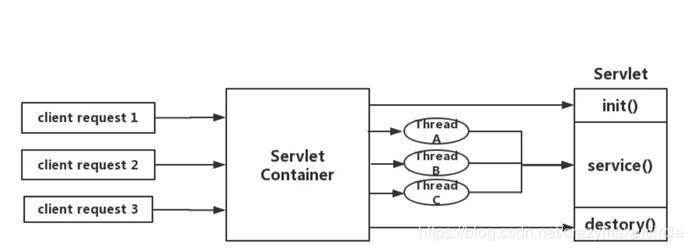
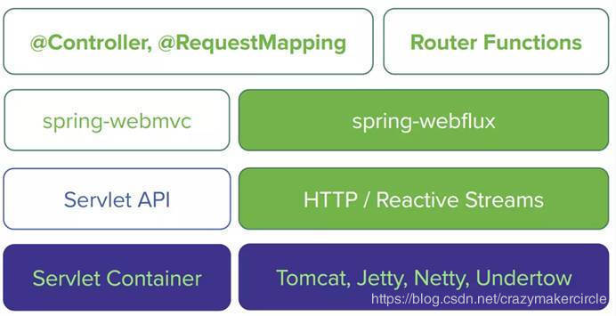
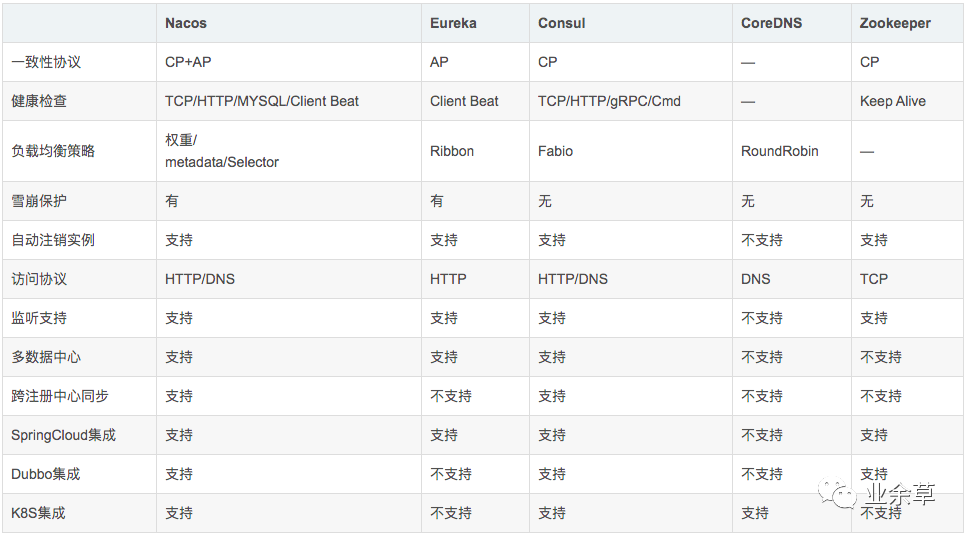
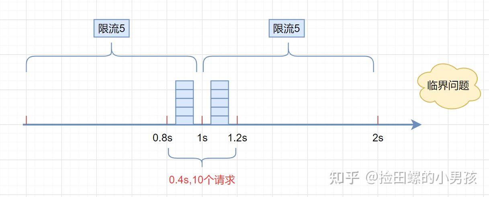
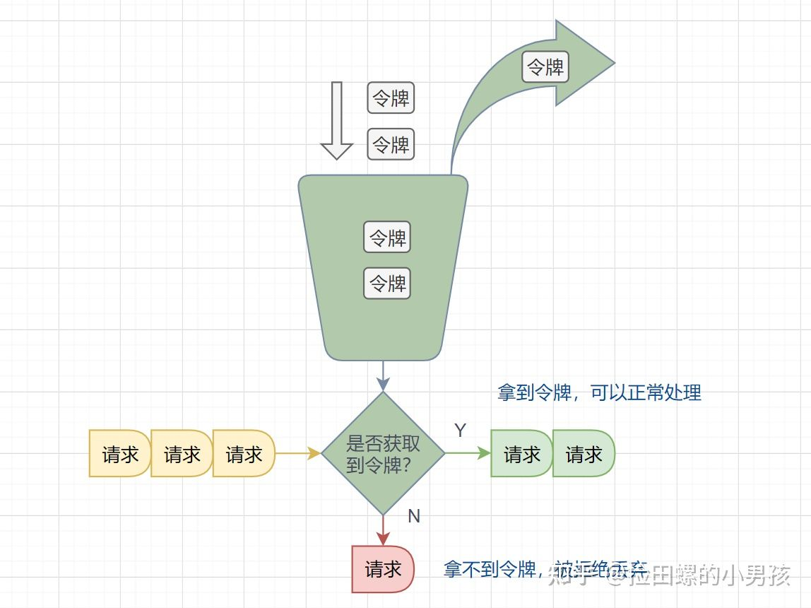
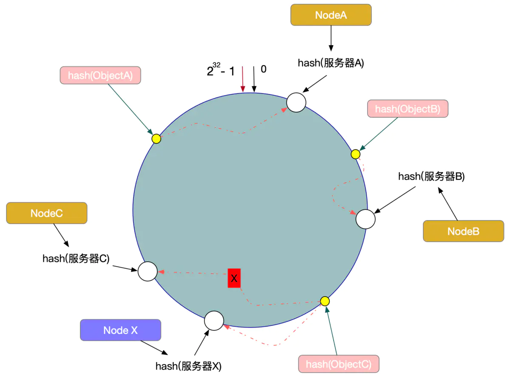

# SpringCloud

## Gateway

SpringCloud Gateway 使用的**Webflux**中的reactor-netty响应式编程组件，底层使用了Netty通讯框架。

Gateway的使用：[SpringCloud gateway](https://www.cnblogs.com/crazymakercircle/p/11704077.html)

### Zuul的IO模型

Springcloud中所集成的Zuul版本，采用的是**Tomcat**容器，使用的是传统的**Servlet** IO处理模型，会为每个请求分配一个线程来处理，无法应付高并发场景下的需求，所以Springcloud Zuul 是基于servlet之上的一个阻塞式处理模型。

### Webflux 服务器

> - `Reactive Stream` 是一套反应式编程 **标准** 和 **规范**；它由发布者、订阅者、订阅、处理器组成。
> - `Reactor` 是基于 `Reactive Streams` 一套 **反应式编程框架**；Mono实现了发布者功能，返回0-1个元素，Flux返回N个元素。
> - `WebFlux` 以 `Reactor` 为基础，实现 `Web` 领域的 **反应式编程框架**。在 WebFlux 接口中，请求不会被阻塞，所以服务端的接口耗时为 0。

## 注册中心

服务注册中心本质上是为了**解耦服务提供者和服务消费者**。对于任何一个微服务，原则上都应存在或者支持多个提供者，这是由微服务的分布式属性决定的。更进一步，为了支持弹性扩缩容特性，一个微服务的提供者的数量和分布往往是动态变化的，也是无法预先确定的。因此，原本在单体应用阶段常用的静态LB机制就不再适用了，需要引入额外的组件来管理微服务提供者的注册与发现，而这个组件就是服务注册中心。

> 需要考虑的问题：
>
> - 测活：服务注册之后，如何对服务进行测活以保证服务的可用性？
> - 负载均衡：当存在多个服务提供者时，如何均衡各个提供者的负载？
> - 集成：在服务提供端或者调用端，如何集成注册中心？
> - 运行时依赖：引入注册中心之后，对应用的运行时环境有何影响？
> - 可用性：如何保证注册中心本身的可用性，特别是消除单点故障？

### CAP理论

- 一致性(Consistency) (所有节点在同一时间具有相同的数据)
- 可用性(Availability) (保证每个请求不管成功或者失败都有响应)
- 分隔容忍(Partition tolerance) (系统中任意信息的丢失或失败不会影响系统的继续运作)

### Nacos

* Nacos内部接收到注册的请求时，不会立即写数据，而是将服务注册的任务放入一个阻塞**队列**就立即响应给客户端。然后利用线程池读取阻塞队列中的任务，异步来完成实例更新，从而提高并发写能力。
* Nacos在更新实例列表时，会采用**CopyOnWrite**技术，首先将旧的实例列表拷贝一份，然后更新拷贝的实例列表，再用更新后的实例列表来覆盖旧的实例列表。
* 通过Ribbon实现负载均衡。（随机、轮询、加权、少并发连接优先、重试、区域敏感、可用性敏感）
* vs Eureka：
  * Nacos的实例有永久和临时实例之分；而Eureka只支持临时实例
  * Nacos对临时实例采用心跳模式检测，对永久实例采用主动请求来检测；Eureka只支持心跳模式
  * Nacos支持定时拉取和订阅推送两种模式；Eureka只支持定时拉取模式
* 配置中心：
  * 一般会存：可能会经常变化的配置信息，例如连接池，日志，线程池，限流熔断规则
  * 我们的服务一般会先从内存中读取配置信息，同时我们的微服务还可以定时向nacos配置中心发请求拉取更新的配置信息

## 限流

### 限流算法

* 固定窗口限流

  > 首先维护一个计数器，**将单位时间段当做一个窗口**，计数器记录这个窗口接收请求的次数。
  >
  > - 当次数少于限流阀值，就允许访问，并且计数器+1
  > - 当次数大于限流阀值，就拒绝访问。
  > - 当前的时间窗口过去之后，计数器清零。

  

* 滑动窗口限流

  > 滑动窗口限流解决**固定窗口临界值的问题**。它将单位时间周期分为n个小周期，分别记录每个小周期内接口的访问次数，并且根据时间滑动删除过期的小周期。

* 漏桶算法

  > 往漏桶中以任意速率流入水，以固定的速率流出水。当水超过桶的容量时，会被溢出，也就是被丢弃。因为桶容量是不变的，保证了整体的速率。
  >
  > 在正常流量的时候，系统按照固定的速率处理请求，是我们想要的。但是**面对突发流量**的时候，漏桶算法还是循规蹈矩地处理请求，这就不是我们想看到的啦。流量变突发时，我们肯定**希望系统尽量快点处理请求**，提升用户体验嘛。

* 令牌桶算法

  > 有一个令牌管理员，根据限流大小，**定速往令牌桶里放令牌**。如果令牌数量满了，超过令牌桶容量的限制，那就丢弃。系统在接受到一个用户请求时，都会先去令牌桶要一个令牌。如果拿到令牌，那么就处理这个请求的业务逻辑；如果拿不到令牌，就直接拒绝这个请求。

  

  Gateway则采用了基于Redis实现的令牌桶算法，而Sentinel内部却比较复杂：

  - 默认限流模式是基于滑动时间窗口算法
  - 排队等待的限流模式则基于漏桶算法
  - 而热点参数限流则是基于令牌桶算法

### Sentinel

* vs Hystrix：

  Hystix默认是基于线程池实现的线程隔离，每一个被隔离的业务都要创建一个独立的线程池，线程过多会带来额外的CPU开销，性能一般，但是隔离性更强。

  Sentinel是基于信号量（计数器）实现的线程隔离，不用创建线程池，性能较好，但是隔离性一般。

* 流量控制：

  * 直接拒绝
  * 冷启动
  * 匀速器

## RPC

### Feign

### Dubbo

#### 一致性哈希算法

[一致性Hash原理与实现 - 简书 (jianshu.com)](https://www.jianshu.com/p/528ce5cd7e8f)

## 链路追踪

## 实战

[使用nacos、openfegin、gateway、链路追踪管理微服务_你看星星很亮的博客-CSDN博客](https://blog.csdn.net/weixin_56320090/article/details/117334865)