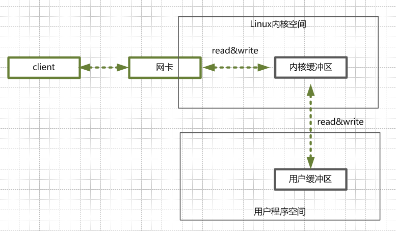
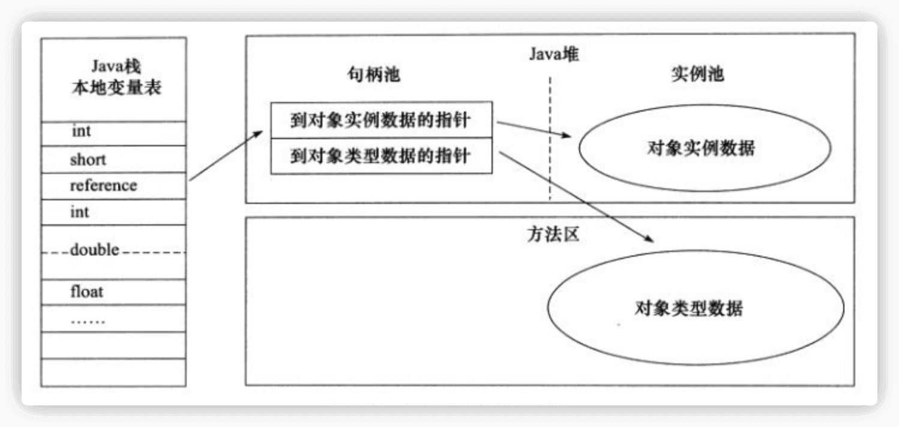

# Java技术栈集锦（个人向）

[rbmonster/learning-note: java开发 面试八股文（个人的面试及工作总结） (github.com)](https://github.com/rbmonster/learning-note)

[docsify-demo (gitee.io)](https://rbmon.gitee.io/learning-note/#/)

[AobingJava/JavaFamily: 【Java面试+Java学习指南】 一份涵盖大部分Java程序员所需要掌握的核心知识。 (github.com)](https://github.com/AobingJava/JavaFamily)

## Java常识

* Java vs C++

  Java 不提供**指针**来直接访问内存，程序内存更加安全
  Java 的类是单**继承**的，C++ 支持多重继承；虽然 Java 的类不可以多继承，但是接口可以多继承。
  Java 有自动内存管理垃圾回收机制(**GC**)，不需要程序员手动释放无用内存。
  C ++同时支持方法重载和操作符**重载**，但是 Java 只支持方法重载（操作符重载增加了复杂性，这与 Java 最初的设计思想不符）......

* 字符常量占 2 个字节; 字符串常量占若干个字节。

* 重写：

  > 1. **方法名、参数列表必须相同**，子类方法返回值类型应比父类方法返回值类型更小或相等，抛出的异常范围小于等于父类，访问修饰符范围大于等于父类。
  > 2. 如果父类方法访问修饰符为 `private/final/static` 则子类就不能重写该方法（同名的子类private叫重新实现该方法），但是被 `static` 修饰的方法能够被再次声明。
  > 3. 构造方法无法被重写。

* 数据类型

  > | 基本类型  | 位数 | 字节 | 默认值  | 取值范围                                   |
  > | :-------- | :--- | :--- | :------ | ------------------------------------------ |
  > | `byte`    | 8    | 1    | 0       | -128 ~ 127                                 |
  > | `short`   | 16   | 2    | 0       | -32768 ~ 32767                             |
  > | `int`     | 32   | 4    | 0       | -2147483648 ~ 2147483647                   |
  > | `long`    | 64   | 8    | 0L      | -9223372036854775808 ~ 9223372036854775807 |
  > | `char`    | 16   | 2    | 'u0000' | 0 ~ 65535                                  |
  > | `float`   | 32   | 4    | 0f      | 1.4E-45 ~ 3.4028235E38                     |
  > | `double`  | 64   | 8    | 0d      | 4.9E-324 ~ 1.7976931348623157E308          |
  > | `boolean` | 1    |      | false   | true、false                                |
  >
  > 对于 `boolean`，官方文档未明确定义，它依赖于 JVM 厂商的具体实现。逻辑上理解是占用 1 位，但是实际中会考虑计算机高效存储因素。
  >
  > Java 的每种基本类型所占存储空间的大小不会像其他大多数语言那样随机器硬件架构的变化而变化。这种**所占存储空间大小的不变性**是 Java 程序比用其他大多数语言编写的程序更具可移植性的原因之一

* HotSpot 虚拟机引入了 JIT 优化之后，会对对象进行逃逸分析，如果发现某一个对象并没有逃逸到方法外部，那么就可能通过标量替换来实现栈上分配，而避免堆上分配内存。

* 如果 `HashSet` 在对比的时候，同样的 `hashCode` 有多个对象，它会继续使用 `equals()` 来判断是否真的相同。也就是说 `hashCode` 帮助我们大大缩小了查找成本。

  重写 equals() 时必须重写 hashCode() 方法。

* `String` 中的 `equals` 方法是被重写过的，比较的是 String 字符串的值是否相等。 `Object` 的 `equals` 方法是比较的对象的内存地址。

* 对于编译期可以确定值的字符串，也就是常量字符串 ，jvm 会将其存入字符串常量池。并且，字符串常量拼接得到的字符串常量在编译阶段就已经被存放字符串常量池，这个得益于编译器的优化。引用的值在程序编译期是无法确定的，编译器无法对其进行优化。

  > 字符串使用 `final` 关键字声明之后，可以让编译器当做常量来处理。
  >
  > ```java
  > final String str1 = "str";
  > final String str2 = "ing";
  > // 下面两个表达式其实是等价的
  > String c = "str" + "ing";// 常量池中的对象
  > String d = str1 + str2; // 常量池中的对象
  > System.out.println(c == d);// true
  > ```
  >
  > 如果 ，编译器在运行时才能知道其确切值的话，就无法对其优化。
  >
  > ```java
  > final String str1 = "str";
  > final String str2 = getStr();
  > String c = "str" + "ing";// 常量池中的对象
  > String d = str1 + str2; // 在堆上创建的新的对象
  > System.out.println(c == d);// false
  > public static String getStr() {
  >       return "ing";
  > }
  > ```

* 异常：

  > **Checked Exception** 即 受检查异常 ，Java 代码在编译过程中，如果受检查异常没有被 `catch`或者`throws` 关键字处理的话，就没办法通过编译。除了`RuntimeException`及其子类以外，其他的`Exception`类及其子类都属于受检查异常 。常见的受检查异常有： IO 相关的异常、`ClassNotFoundException` 、`SQLException`...。
  >
  > 
  >
  > **Unchecked Exception** 即 **不受检查异常** ，Java 代码在编译过程中 ，我们即使不处理不受检查异常也可以正常通过编译。`RuntimeException` 及其子类都统称为非受检查异常，常见的有：
  >
  > - `NullPointerException`(空指针错误)
  > - `IllegalArgumentException`(参数错误比如方法入参类型错误)
  > - `NumberFormatException`（字符串转换为数字格式错误，`IllegalArgumentException`的子类）
  > - `ArrayIndexOutOfBoundsException`（数组越界错误）
  > - `ClassCastException`（类型转换错误）
  > - `ArithmeticException`（算术错误）
  > - `SecurityException` （安全错误比如权限不够）
  > - `UnsupportedOperationException`(不支持的操作错误比如重复创建同一用户)
  > - ......

  * `finally` 块 ： 无论是否捕获或处理异常，`finally` 块里的语句都会被执行。当在 `try` 块或 `catch` 块中遇到 `return` 语句时，`finally` 语句块将在方法返回之前被执行。**注意：不要在 finally 语句块中使用 return!** 当 try 语句和 finally 语句中都有 return 语句时，try 语句块中的 return 语句会被忽略。
* 在某些情况下，finally 中的代码不会被执行，比如，finally 之前虚拟机被终止运行的话，finally 中的代码就不会被执行。
  * 在 `try-with-resources` 语句中，任何 catch 或 finally 块在声明的资源关闭后运行。面对**必须要关闭的资源**，我们总是应该**优先使用** `try-with-resources` 而不是`try-finally`。

* 泛型：

  泛型一般有三种使用方式:**泛型类**、**泛型接口**、**泛型方法**。

  > ```java
  >    public static < E > void printArray( E[] inputArray )
  >    {
  >          for ( E element : inputArray ){
  >             System.out.printf( "%s ", element );
  >          }
  >          System.out.println();
  >     }
  > ```
  >
  > > 类在实例化时才能真正的传递类型参数，由于静态方法的加载先于类的实例化，也就是说类中的泛型还没有传递真正的类型参数，静态的方法的加载就已经完成了，所以**静态泛型方法是没有办法使用类上声明的泛型的**，只能使用自己声明的 `<E>`。

* `static` 变量因为不属于任何对象(Object)，所以无论有没有 `transient` 关键字修饰，均不会被序列化。

* 字符流是由 Java 虚拟机将字节转换得到的，问题就出在这个过程还算是非常耗时，并且，如果我们不知道编码类型就很容易出现乱码问题。所以， I/O 流就干脆提供了一个直接操作字符的接口，方便我们平时对字符进行流操作。

* 代理

  > * 静态代理
  >
  >   静态代理在编译时就将接口、实现类、代理类这些都变成了一个个实际的 class 文件。
  >
  > * 动态代理
  >
  >   * JDK 动态代理有一个最致命的问题是其只能代理实现了接口的类。
  >   * CGLIB是一个基于ASM的字节码生成库，它允许我们在运行时对字节码进行修改和动态生成。CGLIB 通过继承方式实现代理。很多知名的开源框架都使用到了CGLIB， 例如 Spring 中的 AOP 模块中：如果目标对象实现了接口，则默认采用 JDK 动态代理，否则采用 CGLIB 动态代理。
  >
  > * 比较：
  >
  >   **灵活性** ：动态代理更加灵活，不需要必须实现接口，可以直接代理实现类，并且可以不需要针对每个目标类都创建一个代理类。另外，静态代理中，接口一旦新增加方法，目标对象和代理对象都要进行修改，这是非常麻烦的！
  >
  >   **JVM 层面** ：静态代理在编译时就将接口、实现类、代理类这些都变成了一个个实际的 class 文件。而动态代理是在运行时动态生成类字节码，并加载到 JVM 中的。

* IO

  > IO 多路复用模型，通过减少无效的系统调用，减少了对 CPU 资源的消耗。
  >
  > TODO

## Java基础

### 包装类

new Integer(123) 与 Integer.valueOf(123) 的区别在于：

- new Integer(123) 每次都会新建一个对象；

- Integer.valueOf(123) 会使用缓存池中的对象，多次调用会取得同一个对象的引用。

- 包装类的缓存：

  > `Byte`,`Short`,`Integer`,`Long` 这 4 种包装类默认创建了数值 **[-128，127]** 的相应类型的缓存数据，`Character` 创建了数值在 **[0,127]** 范围的缓存数据，`Boolean` 直接返回 `True` or `False`。
  >
  >  valueOf：
  >
  > ```java
  > public static Integer valueOf(int i) {
  >     if (i >= IntegerCache.low && i <= IntegerCache.high)
  >         return IntegerCache.cache[i + (-IntegerCache.low)];
  >     return new Integer(i);
  > }
  > private static class IntegerCache {
  >     static final int low = -128;
  >     static final int high;
  >     static {
  >         // high value may be configured by property
  >         int h = 127;
  >     }
  > }
  > ```
  >
  > 超出对应范围仍然会去创建新的对象。
  >
  > **装箱**的过程其实是调用valueOf。

包装类都为final 不可继承

* 序列化和反序列化

  序列化时，并**不保存静态变量**，这其实比较容易理解，序列化保存的是对象的状态，静态变量属于类的状态，因此 序列化并不保存静态变量。

  Transient 关键字的作用是控制变量的序列化，在变量声明前加上该关键字，可以阻止该变量被序列化到文件中，在被反序列化后，transient 变量的值被设为初始值，如 int 型的是 0，对象型的是 null。

* 精度问题

  由于double不能精确表示0.1等数，因此对于一些对精度要求很高的应用场景，不能使用double，要使用BigDecimal。BigDecimal都是不可变的（immutable）的， 在进行每一次四则运算时，都会产生一个新的对象 ，所以在做加减乘除运算时要记得要保存操作后的值。

* 字符串相关

  字符串贴近底层，被定义为final，不可被继承

  JVM在**堆内存**上留出一个称为字符串常量池的特殊区域，不使用new关键字创建的字符串对象存储在**堆的字符串常量池部分**，使用new关键字创建的字符串对象存储在**堆的普通内存部分**。

  单线程操作字符串缓冲区下操作大量数据，适用StringBuilder

  注意**符号引用**：

  ```java
  String a = "hello2"; 　  
  String b = "hello";       
  String c = b + 2;       
  System.out.println((a == c));
  // 输出结果为:false。由于有符号引用b的存在，所以  String c = b + 2;不会在编译期间被优化，不会把b+2当做字面常量来处理的。
  // 个人理解：因为c不能直接表现为常量池中的字面量，故c经过连接环节，被赋了零值，相当于新建了一个字符串对象，之后在初始化阶段给这个对象赋了真正的值。
  
  String a = "hello2";   　
  final String b = "hello";       
  String c = b + 2;       
  System.out.println((a == c));
  // 输出结果为：true。对于被final修饰的变量，会在class文件常量池中保存一个副本，也就是说不会通过连接而进行访问。
  
  // ==比较的其实就是对象的引用值
  ```

  [java中final属型及初始化问题_myllxy的博客-CSDN博客](https://blog.csdn.net/qq_39327985/article/details/81839685)

  ```java
  class Test {
  	final static int a = 1;
  	static int b = 2;
  	static {
  		System.out.println("访问编译期常量不触发类初始化");
  	}
  }
   
  public class TestMode {
   
  	public static void main(String[] args) {
  		System.out.println(Test.a);
  	}
  }
  //仅输出1
  //若是访问了b，则是1、静态代码块、2
  
  
  
  
  
  class Price {
  	static Price P = new Price(2.7);
  	static double apple = 20;//加上final或是放到前面去执行，那么输出结果为17.3
  	double Price;
   
  	public Price(double orange) {
  		Price = apple - orange;
  	}
  }
  class Main {
  	public static void main(String[] args) {
  		System.out.println(Price.P.Price);//结果为-2.7
  	}
  }
  //这个程序中，在类加载阶段的准备阶段p和apple会被编译器赋予对应类型的默认初值（null和0.0），在随后的类加载的初始化阶段，由于static字段执行顺序是由字段在源文件中出现的顺序决定的，所以会先执行new Price(2.7)，分配对象空间并对其做初始化，在这个时候apple的值还是0.0，所以最终结果为-2.7。
  ```

  

* 装包与拆包

  ```java
  Integer a = -128;
  Integer b = -128;
  System.out.println(a == b); //true
  
  Integer a = -129;
  Integer b = -129;
  System.out.println(a == b); //false
  
  //Integer在-128至127这个范围内是直接从IntegerCache里面取，否则创建新的对象
  ```


### 内存分配

> 方法区
>
> 存放装载的类数据信息，包括：
> 基本信息：每个类的全限定名、每个类的直接超类的全限定名、该类是类还是接口、该类型的访问修饰符、直接超接口的全限定名的有序列表。
> 每个已装载类的详细信息：**运行时常量池**、字段信息、方法信息、**静态变量**、到类classloader的引用、到类class的引用。
>
> 
>
> 栈内存
>  Java栈内存由局部变量区、操作数栈、帧数据区组成，以帧的形式存放本地方法的调用状态（包括方法调用的参数、局部变量、中间结果……）。
>
> 
>
> 堆内存
> 堆内存用来存放由new创建的对象和数组。在堆中分配的内存，由Java虚拟机的自动垃圾回收器来管理。
>
> 
>
> 本地方法栈内存
>  Java通过Java本地接口JNI（Java Native Interface）来调用其它语言编写的程序，在Java里面用native修饰符来描述一个方法是本地方法。

### 静态

```java
//在创建静态内部类的实例时，不需要创建外部类的实例。
public class Outer {
    static class Inner {
        int a = 0;    // 实例变量a
        static int b = 0;    // 静态变量 b
    }
}
class OtherClass {
    Outer.Inner oi = new Outer.Inner();
    int a2 = oi.a;    // 访问实例成员
    int b2 = Outer.Inner.b;    // 访问静态成员
}

//静态内部类可以直接访问外部类的静态成员，如果要访问外部类的实例成员，则需要通过外部类的实例去访问。
public class Outer {
    int a = 0;    // 实例变量
    static int b = 0;    // 静态变量
    static class Inner {
        Outer o = new Outer;
        int a2 = o.a;    // 访问实例变量
        int b2 = b;    // 访问静态变量
    }
}
```

**注意，静态变量或是静态方法和类有关，在实现继承使用多态特性的时候，静态结果和接收方类有关，这要和一般方法区别，因为复写之后，子类一般方法会覆盖父类实现，导致多态后出现子类效果。**

只能访问所属类的**静态字段和静态方法**，**方法中不能有 this 和 super 关键字**，这两个关键字与具体对象关联。


### 初始化顺序

静态变量和静态语句块的初始化顺序取决于它们在代码中的顺序。

> 父类（静态变量、静态语句块）
>
> 子类（静态变量、静态语句块）
>
> 父类（实例变量、普通语句块）
>
> 父类（构造函数）
>
> 子类（实例变量、普通语句块）
>
> 子类（构造函数）

### 监听器

如果当前线程没有获得一个对象的监听器，调用该方法就会抛出一个IllegalMonitorStateException

- 获得当前对象的监听器的方式：
  - 执行此对象的同步 (`Sychronized`) 实例方法
  - 执行在此对象上进行同步的 synchronized 语句的方法
  - 对于 Class 类型的对象，执行该类的同步静态方法


### 修饰符和继承

- 如果**不加**访问修饰符，表示**包级可见**。
- protected 用于修饰成员，表示在继承体系中成员对于子类可见，但是这个访问修饰符对于类没有意义。
- private 仅自己可见
- public 所有均可见

**private 和 protected 不能修饰类**。

如果子类的方法重写了父类的方法，那么**子类中该方法的访问级别不允许低于父类的访问级别**。

### 接口和抽象类

- 接口的字段默认都是 **static 和 final** 的。
- 抽象类中可以有明确的方法体。抽象方法只能出现在抽象类中，并且要被抽象类的子类所实现。
- 抽象类： 拓展继承该抽象类的模块的类的行为功能（开放闭合原则）
  接口：约束继承该接口的类行为（依赖倒置原则）


### 泛型

在调用泛型方法时，可以指定泛型，也可以不指定泛型。

- 在不指定泛型的情况下，泛型变量的类型为该方法中的几种类型的同一父类的最小级，直到 Object。
- 在指定泛型的情况下，该方法的几种类型必须是该泛型的实例的类型或者其子类。

**类型擦除带来的问题及解决方案**

* 编译器**针对引用**检查泛型类型，再进行擦除

  ```java
  public class Test {  
  
      public static void main(String[] args) {  
  
          ArrayList<String> list1 = new ArrayList();  
          list1.add("1"); //编译通过  
          list1.add(1); //编译错误  
          String str1 = list1.get(0); //返回类型就是String  
  
          ArrayList list2 = new ArrayList<String>();  
          list2.add("1"); //编译通过  
          list2.add(1); //编译通过  
          Object object = list2.get(0); //返回类型就是Object
          
          //直接用对象要保证类型符合（我觉得可以理解为返回了一个同类型的引用）
          new ArrayList<String>().add("11"); //编译通过  
          new ArrayList<String>().add(22); //编译错误  
  
          String str2 = new ArrayList<String>().get(0); //返回类型就是String  
      }  
  
  }  
  ```

  **类型检查就是针对引用的**

  ```java
  ArrayList<String> list1 = new ArrayList<Object>(); //编译错误  
  ArrayList<Object> list2 = new ArrayList<String>(); //编译错误
  
  //第一个比较好理解，会出现classCast的异常
  //第二个是因为，泛型的出现就是为了解决类型转换的问题。我们使用了泛型，到头来，还是要自己强转，违背了泛型设计的初衷。所以java不允许这么干。再说，你如果又用list2往里面add()新的对象，那么到时候取得时候，我怎么知道我取出来的到底是String类型的，还是Object类型的呢？
  ```

**桥方法与泛型类继承**

```java
class A<T> {
  private T val;

  public T getVal() {
    return this.val;
  }

  public void setVal(T val) {
    this.val = val;
  }
}

class B extends A<String> {
  @Override
  public String getVal() {
    // TODO Auto-generated method stub
    return super.getVal();
  }

  @Override
  public void setVal(String val) {
    // TODO Auto-generated method stub
    super.setVal(val);
  }
}
```

虽说通过类型擦除，父类参数类型应该是Object，子类应该要继承这个Object类型的成员，但是JVM采用了桥方法，将原本从父类继承而来的成员方法(public Object getVal() ;）中插入调用子类重写的(public String getVal() ;)此时注解Override其实是假象，真正意义为重载，实际编译后子类中有4个方法。而**桥方法的内部实现，就只是去调用我们自己重写的那两个方法**。

```shell
  public void setVal(java.lang.String);
    Code:
       0: aload_0
       1: aload_1
       2: invokespecial #4                  // Method A.setVal:(Ljava/lang/Object;)V
       5: return

  public void setVal(java.lang.Object);
    Code:
       0: aload_0
       1: aload_1
       2: checkcast     #3                  // class java/lang/String    
       5: invokevirtual #5                  // Method setVal:(Ljava/lang/String;)V
       8: return
```

此处需要注意，虽然setVal是理解为重载，但是getVal却因为**协变**而可以实现这个效果，子类中的桥方法Object getValue()和Date getValue()是同时存在的，可是如果是常规的两个方法，他们的方法签名是一样的，也就是说虚拟机根本不能分别这两个方法。如果是我们自己编写Java代码，这样的代码是无法通过编译器的检查的，但是虚拟机却是允许这样做的，因为虚拟机通过参数类型和返回类型来确定一个方法，所以编译器为了实现泛型的多态允许自己做这个看起来“不合法”的事情，然后交给虚拟器去区别。

* **虚拟机巧妙的使用了桥方法，来解决了类型擦除和多态的冲突**。

* 泛型类型变量不能是基本类型

* 由于类型擦除，ArrayList<String> ar=new ArrayList<>();

  只剩下原始类型，泛型String不存在了，因此，在编译期间使用（ar instanceof ArrayList<String>）的做法是错误的

* 泛型类中的静态方法和静态变量不可以使用泛型类所声明的泛型类型参数

  ```java
  public class Test2<T> {    
      public static T one;   //编译错误    
      public static  T show(T one){ //编译错误    
          return null;    
      }    
  }
  ```

  但是，这种是可以的！！！

  ```java
  public class Test2<T> {    
  
      public static <T >T show(T one){ //这是正确的，这个T用的是方法自己的T
          return null;    
      }    
  }
  ```

#### 逆变、协变、不变

[Java泛型的协变与逆变 - 掘金 (juejin.cn)](https://juejin.cn/post/6911302681583681544)

```java
// 调用方法result = method(n)；
// 根据Liskov替换原则，传入形参n的类型应为method形参的子类型，
// 即typeof(n) ≤ typeof(method's parameter)；
// result应为method返回值的基类型，即typeof(methods's return) ≤ typeof(result)：

static Number method(Number num) {
	return 1;
}

Object result = method(new Integer(2)); //correct
Number result = method(new Object()); //error
Integer result = method(new Integer(2)); //error
```

泛型是不变的，借助通配符可以实现“协变”

`List<?>`不能add，get出来也是Object类型。它同时具有协变和逆变的两种性质，上界是Object，但不能调用add方法。

### 注解

作用于代码：

@Override

@Deprecated

@SuppressWarnings

作用于其他注解的注解（元注解）：

@Documented

@Retention

@Target

@Inherited

### 线程


**阻塞是被动**的，它是在等待获取 monitor lock。而**等待是主动**的，通过调用 Object.wait() 等方法进入。

创建线程的开销：JVM 在背后帮我们做了哪些事情：

1. 它为一个线程栈分配内存，该栈为每个线程方法调用保存一个**栈帧**
2. 每一栈帧由一个**局部变量数组**、**返回值**、**操作数堆栈**和**常量池引用**组成
3. 一些支持**本机方法**的 jvm 也会分配一个本机堆栈
4. 每个线程获得一个**程序计数器**，告诉它当前处理器执行的指令是什么
5. 系统创建一个与Java线程对应的**本机线程**
6. 将与线程相关的**描述符添加到JVM内部数据结构中**
7. 线程**共享堆和方法区**

### 其他

#### 方法调用

方法体传递参数时，无论是值还是对象都是“值”传递。**引用类型传递的是引用变量的地址**。

#### 面向对象的三大特性

- 封装：封装是指把一个对象的状态信息（也就是属性）隐藏在对象内部，不允许外部对象直接访问对象的内部信息。

- 继承：不同类型的对象，相互之间经常有一定数量的共同点。

- 多态：表示一个对象具有多种的状态。具体表现为父类的引用指向子类的实例。

  > **多态的特点:**
  >
  > - 对象类型和引用类型之间具有继承（类）/实现（接口）的关系；
  > - 引用类型变量发出的方法调用的到底是哪个类中的方法，必须在程序运行期间才能确定；
  > - 多态不能调用“只在子类存在但在父类不存在”的方法；
  > - 如果子类重写了父类的方法，真正执行的是子类覆盖的方法，如果子类没有覆盖父类的方法，执行的是父类的方法。


## 集合

### ArrayList

> * 以无参数构造方法创建 `ArrayList` 时，实际上初始化赋值的是一个空数组。当真正对数组进行添加元素操作时，才真正分配容量。即向数组中添加第一个元素时，数组容量扩为 10。
> * ArrayList 每次扩容之后容量都会变为原来的 1.5 倍左右

### HashMap 

HashMap的长度为什么是 2 的幂次方**?

> 数组下标的计算方法是“ `(n - 1) & hash`”
>
> 采用二进制位操作 &，相对于%能够提高运算效率，这就解释了 HashMap 的长度为什么是 2 的幂次方。

相比于之前的版本， JDK1.8 之后在解决哈希冲突时有了较大的变化，当**链表长度大于阈值**（默认为 8）（将链表转换成红黑树前会判断，如果当前**数组的长度小于 64**，那么会选择先进行**数组扩容**，而不是转换为红黑树）时，将链表转化为红黑树，以减少搜索时间。

loadFactor 太大导致查找元素效率低，太小导致数组的利用率低，存放的数据会很分散。loadFactor 的默认值为 **0.75f** 是官方给出的一个比较好的临界值。

### ConcurrentHashMap 

> ####  ConcurrentHashMap 和 Hashtable 的区别
>
> `ConcurrentHashMap` 和 `Hashtable` 的区别主要体现在实现线程安全的方式上不同。
>
> - **底层数据结构：** JDK1.7 的 `ConcurrentHashMap` 底层采用 **分段的数组+链表** 实现，JDK1.8 采用的数据结构跟 `HashMap1.8` 的结构一样，数组+链表/红黑二叉树。`Hashtable` 和 JDK1.8 之前的 `HashMap` 的底层数据结构类似都是采用 **数组+链表** 的形式，数组是 HashMap 的主体，链表则是主要为了解决哈希冲突而存在的；
> - **实现线程安全的方式（重要）：** ① **在 JDK1.7 的时候，`ConcurrentHashMap`（分段锁）** 对整个桶数组进行了分割分段(`Segment`)，每一把锁只锁容器其中一部分数据，多线程访问容器里不同数据段的数据，就不会存在锁竞争，提高并发访问率。 **到了 JDK1.8 的时候已经摒弃了 `Segment` 的概念，而是直接用 `Node` 数组+链表+红黑树的数据结构来实现，并发控制使用 `synchronized` 和 CAS 来操作。（JDK1.6 以后 对 `synchronized` 锁做了很多优化）** 整个看起来就像是优化过且线程安全的 `HashMap`，虽然在 JDK1.8 中还能看到 `Segment` 的数据结构，但是已经简化了属性，只是为了兼容旧版本；② **`Hashtable`(同一把锁)** :使用 `synchronized` 来保证线程安全，效率非常低下。当一个线程访问同步方法时，其他线程也访问同步方法，可能会进入阻塞或轮询状态，如使用 put 添加元素，另一个线程不能使用 put 添加元素，也不能使用 get，竞争会越来越激烈效率越低。

JDK**1.7**的ConcurrentHashMap


**JDK1.8 的 ConcurrentHashMap：**

利用 ==CAS + synchronized== 来保证并发更新的安全
底层使用==数组+链表+红黑树==来实现


### CopyOnWriteArrayList

读取操作没有任何同步控制和锁操作，理由就是内部数组 `array` 不会发生修改，只会被另外一个 `array` 替换，因此可以保证数据安全。

`CopyOnWriteArrayList` 写入操作 `add()`方法在添加集合的时候加了锁，保证了同步，避免了多线程写的时候会 copy 出多个副本出来。


### 操作注意

* 使用集合转数组的方法，必须使用集合的 `toArray(T[] array)`，传入的是类型完全一致、长度为 0 的空数组。

* `Arrays.asList()`是泛型方法，传递的数组必须是**对象数组**，而不是基本类型。

* 使用工具类 `Arrays.asList()` 把数组转换成集合时，不能使用其修改集合相关的方法， 它的 `add/remove/clear` 方法会抛出 `UnsupportedOperationException` 异常。`Arrays.asList()` 方法返回的并不是 `java.util.ArrayList` ，而是 `java.util.Arrays` 的一个**内部类**,这个内部类并没有实现集合的修改方法或者说并没有重写这些方法。

  > **正确的将数组转换为 `ArrayList`**：
  >
  > * 手动加入
  >
  > * ```java
  >   List list = new ArrayList<>(Arrays.asList("a", "b", "c"))
  >   ```
  >
  > * 使用 Java8 的 `Stream`(推荐)
  >
  >   ```java
  >   Integer [] myArray = { 1, 2, 3 };
  >   List myList = Arrays.stream(myArray).collect(Collectors.toList());
  >   //基本类型也可以实现转换（依赖boxed的装箱操作）
  >   int [] myArray2 = { 1, 2, 3 };
  >   List myList = Arrays.stream(myArray2).boxed().collect(Collectors.toList());
  >   ```
  >
  > * 使用 Guava
  >
  > * 使用 Apache Commons Collections
  >
  > * 使用 Java9 的 `List.of()`方法


## IO



### IO模型

> * 同步阻塞IO（Blocking IO）
>
>   在内核进行IO执行的两个阶段（内核缓冲区数据、用户缓冲区数据），用户线程都被block。
>
> * 同步非阻塞NIO（None Blocking IO）
>
>   在内核数据没有准备好的阶段，用户线程发起IO请求时，立即返回。用户线程需要**不断地发起IO系统调用**。内核数据到达后，用户线程发起系统调用，用户线程**阻塞**。内核开始复制数据。它就会将数据从kernel内核缓冲区，拷贝到用户缓冲区（用户内存），然后kernel返回结果。
>
> * IO多路复用模型(I/O multiplexing）
>
>   [select/poll/epoll原理_哔哩哔哩_bilibili](https://www.bilibili.com/video/BV1Rq4y1s7uu?spm_id_from=333.337.search-card.all.click&vd_source=7952f3de46a75430d5b02bc512f5f0c6)
>
>   * select
>
>     准备文件描述符fd集合，使用fdset将rset（bitmap）中对应fd的位置置为1，并复制到内核区域，内核遍历判断rset对应的fd是否有数据，若有则返回，没有的话就阻塞。内核将fd位置位表示有数据了，返回到用户态，再进行一次遍历，读出被置位的fd，读出数据。受限于bitmap的长度，监听的文件描述符是有限的（1024）。rset不能重用，每次处理要传新的。
>
>   * poll
>
>     为了解决受限长度的问题，poll使用一个可重用的结构pollfd（fd、events、revents），其他的逻辑和select一样。events表征此时是什么事件，比如读事件、写事件。revents表示是否有数据了。
>
>   * epoll
>
>     [EPOLL原理详解（图文并茂） - Big_Chuan - 博客园 (cnblogs.com)](https://www.cnblogs.com/Hijack-you/p/13057792.html)
>     
>     * 调用epoll_create，内核会创建一个**eventpoll**对象（也就是程序中epfd所代表的对象）。eventpoll对象也是文件系统中的一员，和socket一样，它也会有等待队列。
>     * 通过 epoll_ctl 添加 Sock1、Sock2 和 Sock3 的监视，内核会将 eventpoll的引用添加到这三个 Socket 的等待队列中。（加入到**红黑树**中，重复添加的事件就可以通过红黑树而高效地识别出来）
>     * 当Socket收到数据之后，中断程序会执行将Socket的引用添加到eventpoll对象的**rdlist就绪列表**中。
>     * 假设计算机中正在运行进程 A 和进程 B、C，在某时刻进程 A 运行到了 epoll_wait 语句，会将进程A添加到eventpoll的等待队列中。
>     * 当 Socket 接收到数据，**中断程序**一方面修改 Rdlist，另一方面唤醒 eventpoll 等待队列中的进程，进程 A 再次进入运行状态。因为Soket包含eventpoll对象的引用，因此可以直接操作eventpoll对象。
>
> * 异步IO模型（asynchronous IO）
>
>   在内核kernel的等待数据和复制数据的两个阶段，用户线程都不是block(阻塞)的。用户线程需要接受kernel的IO操作完成的事件，或者说注册IO操作完成的回调函数，到操作系统的内核。所以说，异步IO有的时候，也叫做信号驱动 IO 。
>
> 
>
> BIO是面向流的，NIO是面向缓冲区的；BIO的各种流是阻塞的。而NIO是非阻塞的；BIO的Stream是单向的，而NIO的channel是双向的。

* mmap

  Linux通过内存映像机制来提供用户程序对内存直接访问的能力。内存映像的意思是把内核中特定部分的内存空间映射到用户级程序的内存空间去。也就是说，**用户空间和内核空间共享一块相同的内存**。这样做的直观效果显而易见：内核在这块地址内存储变更的任何数据，用户可以立即发现和使用，根本无须数据拷贝。

### Netty

> Netty 是一个 **基于 NIO** 的 client-server(客户端服务器)框架，使用它可以快速简单地开发网络应用程序。它极大地简化并优化了 TCP 和 UDP 套接字服务器等网络编程,并且性能以及安全性等很多方面甚至都要更好。**支持多种协议** 如 FTP，SMTP，HTTP 以及各种二进制和基于文本的传统协议。

> Netty高性能表现
>
> - IO 线程模型：同步非阻塞，用最少的资源做更多的事。
> - 内存**零拷贝**：尽量减少不必要的内存拷贝，实现了更高效率的传输。
> - **内存池**设计：申请的内存可以重用，主要指直接内存。内部实现是用一颗二叉查找树管理内存分配情况。
> - **串形化处理读写**：避免使用锁带来的性能开销。
> - 高性能**序列化**协议：支持 protobuf 等高性能序列化协议。

#### 重要组件

- Channel：Netty 网络操作抽象类，包括基本的 I/O 操作，如 bind、connect、read、write 等。
- EventLoop：主要是配合 Channel 处理 I/O 操作，用来处理连接的生命周期中所发生的事情。
- ChannelFuture：Netty 框架中所有的 I/O 操作都为**异步**的，因此我们需要 ChannelFuture 的 addListener()注册一个 ChannelFutureListener 监听事件，当操作执行成功或者失败时，监听就会自动触发返回结果。
- ChannelHandler：充当了所有处理入站和出站数据的逻辑容器。ChannelHandler 主要用来处理各种事件，这里的事件很广泛，比如可以是连接、数据接收、异常、数据转换等。
- ChannelPipeline：为 ChannelHandler 链提供了容器，当 channel 创建时，就会被自动分配到它专属的 ChannelPipeline，这个关联是永久性的。

#### 零拷贝

Netty 的传输依赖于**零拷贝**特性，尽量减少不必要的内存拷贝，实现了更高效率的传输。

> 传统数据拷贝过程
>
> * 仅CPU方式
>
>   
>
> * CPU+DMA方式
>
>   

目前来看，零拷贝技术的几个实现手段包括：mmap+write、sendfile、sendfile+DMA收集、splice等。

##### mmap

mmap是Linux提供的一种内存映射文件的机制，它实现了将内核中读缓冲区地址与用户空间缓冲区地址进行映射，从而实现内核缓冲区与用户缓冲区的共享。这样就减少了一次用户态和内核态的CPU拷贝，但是在内核空间内仍然有一次CPU拷贝，而且状态切换次数并没有减少。mmap对大文件传输有一定优势，但是**小文件可能出现碎片**，并且在多个进程同时操作文件时可能产生引发coredump的signal。


##### sendfile

sendfile方式只使用**一个函数**就可以完成之前的read+write 和 mmap+write的功能，这样就少了2次状态切换，由于数据不经过用户缓冲区，因此该**数据无法被修改**。


* 优化

  

  升级后的sendfile将内核空间缓冲区中对应的数据描述信息（**文件描述符、地址偏移量**等信息）记录到socket缓冲区中。**DMA控制器根据socket缓冲区中的地址和偏移量将数据从内核缓冲区拷贝到网卡中**，从而省去了内核空间中仅剩1次CPU拷贝。

  这种方式有2次状态切换、0次CPU拷贝、2次DMA拷贝，但是仍然无法对数据进行修改，并且需要硬件层面DMA的支持，并且sendfile只能将文件数据拷贝到socket描述符上，有一定的局限性。

##### splice

splice 系统调用可以在内核缓冲区和socket缓冲区之间建立管道来传输数据，避免了两者之间的 CPU 拷贝操作。

splice也有一些局限，它的两个文件描述符参数中有一个必须是管道设备。


#### Reactor模式

[进击的NIO！Reactor模式！ (qq.com)](https://mp.weixin.qq.com/s/vWbbn1qXRFVva8Y9yET18Q)

##### 单Reactor单线程

只有一个`select`循环接收请求，客户端（client）注册进来由`Reactor`接收注册事件，然后再由reactor分发（dispatch）出去，由下面的处理器（Handler）去处理。只要其中一个Handler方法阻塞了，那就会导致所有的client的Handler都被阻塞了，也会导致注册事件也无法处理，无法接收新的请求。

##### 单Reactor多线程


多线程Reactor模式在Handler读写处理时，交给工作线程池处理，不会导致Reactor无法执行，因为Reactor分发和Handler处理是分开的，能充分地利用资源。从而提升应用的性能。

缺点：Reactor只在主线程中运行，承担所有事件的监听和响应，如果短时间的高并发场景下，依然会造成性能瓶颈。

##### 多Reactor多线程


mainReactor 主要是用来处理客户端请求连接建立的操作。subReactor主要做和建立起来的连接做数据交互和事件业务处理操作，每个subReactor一个线程来处理。


#### TCP粘包拆包

TCP是以流的方式来处理数据，一个完整的包可能会被TCP拆分成多个包进行发送，也可能把小的封装成一个大的数据包发送。应用程序写入的字节大小大于套接字发送缓冲区的大小，会发生拆包现象，而应用程序写入数据小于套接字缓冲区大小，网卡将应用多次写入的数据发送到网络上，这将会发生粘包现象。

可以使用消息定长：FixedLengthFrameDecoder类，或在消息末尾加上特殊字符分割，可以使用自定义的序列化编解码器。

> - 专门针对 Java 语言的：Kryo，FST 等等
> - 跨语言的：Protostuff（基于 protobuf 发展而来），ProtoBuf，Thrift，Avro，MsgPack 等等

#### Netty的零拷贝

- Netty 的接收和发送 ByteBuffer 采用 DIRECT BUFFERS，**使用堆外直接内存**进行 Socket 读写，不需要进行字节缓冲区的二次拷贝。如果使用传统的堆内存（HEAP BUFFERS）进行 Socket 读写，JVM 会将堆内存 Buffer 拷贝一份到直接内存中，然后才写入 Socket 中。相比于堆外直接内存，消息在发送过程中多了一次缓冲区的内存拷贝。
- Netty 提供了组合 Buffer 对象，可以**聚合多个 ByteBuffer 对象**，用户可以像操作一个 Buffer 那样方便的对组合 Buffer 进行操作，避免了传统通过内存拷贝的方式将几个小 Buffer 合并成一个大的 Buffer。
- Netty 的文件传输采用了 **transferTo** 方法，它可以**直接将文件缓冲区的数据发送到目标 Channel**，避免了传统通过循环 write 方式导致的内存拷贝问题。

#### 长连接与心跳机制

TCP 在进行读写之前，server 与 client 之间必须提前建立一个连接。建立连接的过程，需要我们常说的三次握手，释放/关闭连接的话需要四次挥手。这个过程是比较消耗网络资源并且有时间延迟的。短连接说的就是 server 端 与 client 端建立连接之后，读写完成之后就关闭掉连接，如果下一次再要互相发送消息，就要重新连接。

长连接说的就是 client 向 server 双方建立连接之后，即使 client 与 server 完成一次读写，**它们之间的连接并不会主动关闭**，后续的读写操作会继续使用这个连接。长连接的可以省去较多的 TCP 建立和关闭的操作，降低对网络资源的依赖，节约时间。对于频繁请求资源的客户来说，非常适用长连接。

在 TCP 保持长连接的过程中，可能会出现断网等网络异常出现，异常发生的时候， client 与 server 之间如果没有交互的话，他们是**无法发现对方已经掉线**的。为了解决这个问题, 我们就需要引入 **心跳机制** 。


## JVM

### 数据区


* PC

  > 唯一一个无OOM的区域，多线程切换时，每个线程有独立的PC

* 虚拟机栈

  > 每个方法执行的时候，Java虚拟机都会同步的创建一个栈帧用于储存局部变量表、操作数栈、动态链接、方法出口等信息。
  >
  > 局部变量表存放**基本数据类型**、**对象引用**、returnAddr类型（指向一条字节码指令的地址）
  >
  > 在**栈深度溢出**或**栈扩展失败**时分别抛出StackOverFlowError和OutOfMemoryError的异常。
  >
  > 栈帧随着方法调用而创建，随着方法结束而销毁。无论方法正常完成还是异常完成都算作方法结束。

* 本地方法栈

  > 为虚拟机使用到的本地（Native）方法服务。
  >
  > 本地方法被执行的时候，在本地方法栈也会创建一个栈帧，用于存放该本地方法的局部变量表、操作数栈、动态链接、出口信息。

* 堆

  > 是虚拟机所管理的内存中最大的一块。Java堆是==**被所有线程共享的一块内存区域**==，在虚拟机启动时创建。存放对象实例、数组。
  >
  > 如果某些方法中的对象引用没有被返回或者未被外面使用（也就是**未逃逸**出去），那么对象可以直接在栈上分配内存。

  

  JDK 8 版本之后 PermGen(永久) 已被 Metaspace(元空间) 取代，元空间使用的是直接内存。

  > **字符串常量池** 是 JVM 为了提升性能和减少内存消耗针对字符串（String 类）专门开辟的一块区域，主要目的是为了**避免字符串的重复创建**。
  >
  > JDK1.7 之前，字符串常量池存放在永久代。JDK1.7 字符串常量池和静态变量从永久代移动了 **Java 堆**中。
  >
  > **永久代（方法区实现）的 GC 回收效率太低**，只有在整堆收集 (Full GC)的时候才会被执行 GC。Java 程序中通常会有大量的被创建的字符串等待回收，将字符串常量池放到堆中，能够更高效及时地回收字符串内存。

* 方法区

  > 被各个**线程共享**的内存区域，它用于存储已被虚拟机加载的**类型信息**、**常量**、**静态变量**、**即时编译器编译后的代码缓存**等数据。
  >
  >  
  >
  > * **运行时常量池**
  >
  >   **运行时常量池是方法区的一部分**。Class文件除类字段、方法、接口等描述信息外，还有一项信息是常量池表，用于存放编译期生成的各种**字面量**和**符号引用**，在类加载后存放到运行时常量池中。
  >
  >   > 字面量是源代码中的固定值的表示法，即通过字面我们就能知道其值的含义。字面量包括整数、浮点数和字符串字面量。符号引用包括类符号引用、字段符号引用、方法符号引用和接口方法符号引用。
  >   >
  >   > 常量池表会在类加载后存放到方法区的运行时常量池中。
  >
  > * **方法区和永久代以及元空间是什么关系呢？** 
  >
  >   永久代以及元空间是 HotSpot 虚拟机对虚拟机规范中**方法区的两种实现方式**。并且，永久代是 JDK 1.8 之前的方法区实现，JDK 1.8 及以后方法区的实现变成了元空间。
  >
  > * **为什么要将永久代 (PermGen) 替换为元空间 (MetaSpace) 呢?**
  >
  >   整个永久代有一个 JVM 本身设置的固定大小上限，无法进行调整，而元空间使用的是直接内存，受本机可用内存的限制，虽然元空间仍旧可能溢出，但是比原来出现的几率会更小。由系统的实际可用空间来控制元空间，这样能加载的类就更多了。

* 直接内存

  > JDK1.4 中新加入的 NIO(New Input/Output) 类，引入了一种基于通道（Channel）与缓存区（Buffer）的 I/O 方式，它可以直接使用 Native 函数库直接分配堆外内存，然后通过一个存储在 Java 堆中的 DirectByteBuffer 对象作为这块内存的引用进行操作。这样就能在一些场景中显著提高性能，因为避免了在 Java 堆和 Native 堆之间来回复制数据。

#### 样例

```java
public class JHSDB_TestCase {

    static class Test {
        static ObjectHolder staticObj = new ObjectHolder();
        ObjectHolder instantObj = new ObjectHolder();

        void foo(){
            ObjectHolder localObj = new ObjectHolder();
            System.out.println("done");
        }
    }

    private static class ObjectHolder{}

    public static void main(String[] args) {
        Test test = new JHSDB_TestCase.Test();
        test.foo();
    }
}

/*
    staticObj、instantObj、localObj三个变量本身(而不是它们所指向的对象)存放在哪里？
    staticObj随着Test的信息类型存放在方法区，instantObj随着Test对象存放在java堆，localObj则存放在foo()方法栈帧的局部变量表。

    staticObj对象与class对象存放在一起，存储于Eden Java堆中。（JDK7及以后的版本）
    instantObj对象存放在Eden Java堆中
    localObj对象存放在Eden Java堆中
*/
```

### 对象的创建

> * 类加载检查
>
>   虚拟机遇到一条 new 指令时，首先将去检查这个指令的参数是否能在常量池中定位到这个类的符号引用，并且检查这个**符号引用代表的类是否已被加载过、解析和初始化过**。如果没有，那必须先执行相应的类加载过程。
>
> * 分配内存
>
>   分配方式有 **“指针碰撞”** 和 **“空闲列表”** 两种（详见GC部分），选择哪种分配方式由 Java 堆是否规整决定，而 Java 堆是否规整又由所采用的垃圾收集器是否带有压缩整理功能决定。
>
>   内存分配并发问题：CAS+失败重试、TLAB（线程预分配的一块内存，用完了之后再CAS+重试）
>
> * 初始化零值
>
> * 设置对象头
>
>   **Hotspot 虚拟机的对象头包括两部分信息**，**第一部分用于存储对象自身的运行时数据**（哈希码、GC 分代年龄、锁状态标志等等），**另一部分是类型指针**，即对象指向它的类元数据的指针，虚拟机通过这个指针来确定这个对象是哪个类的实例。
>
> * 初始化零值完成之后，**虚拟机要对对象进行必要的设置**，例如这个对象是哪个类的实例、如何才能找到类的元数据信息、对象的哈希码、对象的 GC 分代年龄等信息。 **这些信息存放在对象头中。** 另外，根据虚拟机当前运行状态的不同，如是否启用偏向锁等，对象头会有不同的设置方式。
>
> * 执行 init 方法

建立对象就是为了使用对象，我们的 Java 程序通过栈上的 reference 数据来操作堆上的具体对象。对象的访问方式由虚拟机实现而定，目前主流的访问方式有：**使用句柄**、**直接指针**。




### GC

> 程序计数器、虚拟机栈、本地方法栈随线程而生而灭，因此这几个区域的内存分配和回收都具备确定性，不需要过多考虑回收问题。

#### 判断对象是否已死

* 引用计数法

  - 类似于文件的打开，效率高

  - 缺点：难以解决对象之间互相**循环引用**的问题。


* 可达性分析法

  堆空间外的一些结构，都可以作为 GC Roots 进行可达性分析。

如果要使用可达性分析算法来判断内存是否可回收，那么分析工作必须在一个能保障一致性的快照中进行。这点不满足的话分析结果的准确性就无法保证。这点也是导致 GC进行时必须“**stop The World**”的一个重要原因。

**GC Roots的对象**分为以下几种：

> **虚拟机栈**中的引用对象，入线程调用方法堆栈的参数、局部变量、临时变量等。
>
> 在**方法区中类静态属性**引用的对象。如Java类的引用类型静态变量。
>
> 在**方法区中常量引用**对象，如字符串常量池的引用。
>
> 在本地方法栈中的**JNI**（Native方法）引用的对象。
>
> Java虚拟机内部的引用，如基本类型对应的Class对象，一些常驻异常对象（NullPointException)等，还有系统类加载器。
>
> 所有被同步**锁**(synchronize关键字)持有的对象。
>
> 反映Java虚拟机内部情况的JMXBean、JVMTI中注册的回调、本地缓存代码等。

#### 方法区的回收

方法区的回收主要是两部分内容：**废弃的常量**和**不再使用的类型**。

废弃的常量：比如字符串常量进入常量池，而当前没有任何一个字符串对象的值为它，这样就会被清理出常量池。

不再使用的类型，需要**同时满足**

> * 该类的**所有实例已经被回收**，也就是已经不存在该类及其任何派生的子类实例了。
>
> * 加载该类的**类加载器**已经被回收。正常很难达成。如OSGi、JSP的重加载会产生。
>
> * 该类对应的java.lang.**Class对象没有在任何地方被引用**，无法在任何地方通过反射访问该类的方法。

#### 垃圾收集

##### 新生代垃圾回收

* eden、 survivor From 复制到 survivor To，年龄+1。

  > 首先，把 Eden 和 survivor From 区域中存活的对象复制到 survivor To 区域（如果有对象的年龄以及**达到了老年的标准**，则赋值到老年代区），同时把这些对象的年龄+1（如果 ServicorTo 不够位置了就放到老年区）；
  >
  > 大对象直接进入老年代主要是为了避免为大对象分配内存时由于分配担保机制带来的复制而降低效率。
  >
  > 当累积的某个年龄大小超过了 survivor 区的 50% 时，取这个年龄和 MaxTenuringThreshold 中更小的一个值，作为新的晋升年龄阈值。

* 清空 eden、 survivor From。

* survivor To 和 survivor From 互换

* 针对 HotSpot VM 的实现，它里面的 GC 其实准确分类只有两大种：

  * 部分收集 (Partial GC)：

    - 新生代收集（Minor GC / Young GC）：只对新生代进行垃圾收集；

    - 老年代收集（Major GC / Old GC）：只对老年代进行垃圾收集。<u>需要注意的是 Major GC 在有的语境中也用于指代整堆收集</u>；

    - 混合收集（Mixed GC）：对整个新生代和部分老年代进行垃圾收集。

  * 整堆收集 (Full GC)：收集整个 Java 堆和方法区。

为什么需要Survivor区域？

> **防止对象过早进入Old**，导致Old频繁Full GC。Survivor具有预筛选保证，只有对象到一定岁数才会送往老年代，Survivor区可以减少被送到老年代的对象，进而减少Full GC发生。

> 如果只有一个Survivor，每次垃圾回收年龄+1，会有部分对象进入老年代，导致Survivor的空间变成**碎片化空间**，最后触发minor gc。使用两个Survivor并进行交换，就保证了两个Survivor区，一个为空，另一个是非空且无碎片保存的。

空间分配担保是为了确保在 Minor GC 之前老年代本身还有容纳新生代所有对象的剩余空间。


##### ==**收集算法**==

> * 标记-清除算法
>
>   标记出所有需要回收的对象，在标记完成后，统一回收掉所有标记的对象
>
>   执行效率不稳定，**内存碎片化**
>
>
> * 标记-复制算法
>
>   将内存分为两个大小相等的空间，每次只使用其中一块。当一块的内存使用完了，就将还存活的对象复制到另一块上去，然后把已使用过的空间一次性清理干净。
>
>   老年代一般不直接使用该算法，因为老年代对象存活率较高
>
>
> * 标记-整理算法
>
>   根据**老年代**的特点提出的一种标记算法，标记过程仍然与“标记-清除”算法一样，但后续步骤不是直接对可回收对象回收，而是让所有存活的对象向一端**移动**，然后直接**清理掉端边界以外的内存**。
>
> * 分代收集
>
>   比如在新生代中，每次收集都会有大量对象死去，所以可以选择”标记-复制“算法，只需要付出少量对象的复制成本就可以完成每次垃圾收集。而老年代的对象存活几率是比较高的，而且没有额外的空间对它进行分配担保，所以我们必须选择“标记-清除”或“标记-整理”算法进行垃圾收集。
>
>   在老年代这种每次回收都有大量存活的区域，移动存活对象并更新所有引用这些对象的地方会是一种极其负重的工作，工作期间必须暂停用户应用程序才能进行。
>
>   平常用标记-清除算法，直到空间碎片化已经影响到对象分配，再使用标记-整理算法。

##### ==**经典垃圾收集器**==


> GC中的**并行和并发**：
>
> - **并行（Parallel）** ：指多条垃圾收集线程并行工作，但此时用户线程仍然处于等待状态。
> - **并发（Concurrent）**：指用户线程与垃圾收集线程同时执行（但不一定是并行，可能会交替执行），用户程序在继续运行，而垃圾收集器运行在另一个 CPU 上。

###### Serial收集器

> 一个**单线程**的垃圾收集器，在垃圾收集时必须暂停其他所有工作线程（STW），直到收集结束，简单高效。
>
> **新生代采用标记-复制算法，老年代采用标记-整理算法。**

###### ParNew收集器

> **Serial收集器的多线程并行版本**。随着可以被使用的处理核心增加，ParNew对于垃圾收集时系统可以高效利用，默认开启的收集线程数和处理器核心数量相同。
>
> 
>
> 

###### Parallel Scavenge收集器

> 新生代收集器，同样基于**标记-复制**算法，能够**并行收集**的多线程收集器。它看上去几乎和 ParNew 都一样，特点是达到一个可控制的**吞吐量**。吞吐量就是 CPU 中用于**运行用户代码的时间**与 CPU 总消耗时间的比值。

###### Serial Old收集器

> 老年代使用**标记-整理**算法暂停所有线程。可以Parallel Scavenge收集器搭配使用，另一种是作为CMS收集器发生失败的后备方案。

###### Paralle Old收集器

> Parallel Scavenge收集器的老年版本，支持**多线程并发收集**，基于**标记-整理**算法。与Parallel Scavenge搭配作为“**吞吐量优先**”的收集器搭配组合

###### CMS（Concurrent Mark Sweep）收集器

> 一种以获取**最短回收停顿时间**为目标的收集器，工作于**老年代**。基于**标记-清除**算法实现。

步骤：

* 初始标记：仅仅标记一下**GC Root对象能直接关联到的对象**，速度很快，需要**暂停所有线程**。

* 并发标记：从GC Root关联对象开始遍历整个对象图的过程，可以与用户线程共同执行。

* 重新标记：由于第三阶段是并发的，对象引用可能会发生进一步改变，因此**应用程序线程会再一次被暂停**以更新这些变化。这个阶段的停顿时间一般会比初始标记阶段的时间稍长，远远比并发标记阶段时间短。

* 并发清除：清理删除掉标记阶段判断的已经死亡的对象，由于不需要移动对象，因此可以与用户线程共同执行。


> 特点：
>
> * 对处理器资源非常敏感。
> * 无法处理“**浮动垃圾**”，<u>有可能出现并发模式失败进而导致一次Full GC</u>。浮动垃圾为出现在标记过程结束之后产生的对象。因为CMS要支持收集过程中与用户线程并存，因此不能在老年代几乎被填满时再运行，需要预留一部分空间供并发收集的程序运行。
> * 它使用的回收算法-“标记-清除”算法会导致收集结束时会有大量空间碎片产生。

> CMS垃圾回收分为Background和Foreground，Foreground会进行一次压缩式GC。
>
> Background回收过程中STW主要在初始标记和重新标记阶段，final remark阶段和初始标记流程类似，多了**Card Table 遍历**、**Reference 实例的清理**。
>
> CMS并发退化为Foreground单线程串行模式有两种算法，MSC（是一种Full GC）、不带压缩动作处理Old区（和普通CMS类似）

> 跨代引用：
>
> * 记忆集
>
>   记忆集是一种抽象概念，用于在实现部分垃圾收集（Partial GC）时**用于记录从非收集区域指向收集区域的指针集合**，卡表是记忆集的一种实现方式。例如在分代式GC中，通常能单独收集的只有Young gen，那记忆集记录的就是Old gen指向Young gen的跨代指针。
>
>   一个**卡页**的内存中通常包含不止一个对象，只要卡页内有一个（或更多）对象的字段存在着跨代指针，那就将对应卡表的数组元素的值标识为1，成这个元素变**脏**（Dirty），没有则标识为0。在垃圾收集发生时，只要筛选出卡表中变脏的元素，就能轻易得出哪些卡页内存块中包含跨代指针，把他们**加入GC Roots中一并扫描**。
>
> * 写屏障
>
>   可以看成是虚拟机层面在”引用类型字段赋值“这个动作的AOP切面，引用对象赋值的时候产生一个环形通知，进行一些额外的处理，这样就是引用对象赋值这个操作都在写屏障的覆盖范围内，赋值前的写屏障叫写前屏障，赋值后的写屏障叫写后屏障。
>
> [GC两个关键难点：跨代引用与并发标记_三侠剑的博客-CSDN博客](https://blog.csdn.net/yunxing323/article/details/109231330?utm_medium=distribute.pc_relevant.none-task-blog-2~default~baidujs_baidulandingword~default-0-109231330-blog-107350635.pc_relevant_multi_platform_whitelistv2_ad_hc&spm=1001.2101.3001.4242.1&utm_relevant_index=3)

###### Garbage First（G1）收集器


> G1**整体是基于标记-整理**算法实现的收集器，但从**局部又是基于标记-复制**算法实现。在执行标记整理的时候，还进行了压缩的工作，这是之前的垃圾收集器都没有的。
>
> * G1并**不会等内存耗尽**(串行、并行)或者快耗尽(CMS)的时候开始垃圾收集，而是在内部采用了启发式算法，在老年代找出具有高收集收益的分区进行收集。
> * G1采用内存分区的思路，将内存划分为一个个相等大小的内存分区，回收时则以分区为单位进行回收，存活的对象复制到另一个空闲分区中。由于都是**以相等大小的分区为单位进行操作**，因此G1天然就是一种压缩方案(局部压缩)；
> * G1虽然也是分代收集器，但整个内存分区不存在物理上的年轻代与老年代的区别，也不需要完全独立的survivor(to space)堆做复制准备。G1只有逻辑上的分代概念，或者说**每个分区都可能随G1的运行在不同代之间前后切换**；
> * G1收集都是**STW**的，但年轻代和老年代的收集界限比较模糊，采用了混合(mixed)收集的方式。
>


在G1中，还有一种特殊的区域，叫Humongous区域。 如果一个对象占用的空间**超过了分区容量50%以上**，G1收集器就认为这是一个巨型对象。这些巨型对象，默认直接会被分配在年老代，但是如果它是一个短期存在的巨型对象，就会对垃圾收集器造成负面影响。为了解决这个问题，G1划分了一个Humongous区，它用来专门存放巨型对象。如果一个H区装不下一个巨型对象，那么G1会寻找连续的H分区来存储。为了能找到连续的H区，有时候不得不启动Full GC。

> * Young GC
>
>   G1引进了RSet的概念。它的全称是Remembered Set，作用是跟踪指向某个heap区内的对象引用。
>
>   
>
>   G1中使用point-in来解决。point-in的意思是哪些分区引用了当前分区中的对象。这样，仅仅将这些对象当做根来扫描就避免了无效的扫描。由于新生代有多个，那么我们需要在新生代之间记录引用吗？这是不必要的，原因在于每次GC时，所有新生代都会被扫描，所以**只需要记录老年代到新生代之间的引用**即可。
>
>   如果引用的对象很多，赋值器需要对每个引用做处理，赋值器开销会很大，为了解决赋值器开销这个问题，在G1 中又引入了另外一个概念，**卡表**（Card Table）。<u>一个Card Table将一个分区在逻辑上划分为固定大小的连续区域，每个区域称之为卡。</u>卡通常较小，介于128到512字节之间。Card Table通常为字节数组，由Card的索引（即数组下标）来标识每个分区的空间地址。默认情况下，每个卡都未被引用。当一个地址空间被引用时，这个地址空间对应的数组索引的值被标记为”0″，即标记为脏被引用，此外RSet也将这个数组下标记录下来。一般情况下，这个RSet其实是一个Hash Table，Key是别的Region的起始地址，Value是一个集合，<u>里面的元素是Card Table的Index</u>。
>
>   **Young GC 阶段：**
>
>   - 阶段1：根扫描
>     静态和本地对象被扫描
>   - 阶段2：更新RS
>     处理dirty card队列更新RS
>   - 阶段3：处理RS
>     检测从年轻代指向年老代的对象
>   - 阶段4：对象拷贝
>     拷贝存活的对象到survivor/old区域
>   - 阶段5：处理引用队列
>     软引用，弱引用，虚引用处理
>
> 
>
> * Mixed GC
>
>   Mix GC不仅进行正常的新生代垃圾收集，同时也回收部分后台扫描线程标记的老年代分区。
>
>   在进行Mix GC之前，会先进行global concurrent marking（全局并发标记）。在G1 GC中，它主要是为Mixed GC提供标记服务的，并不是一次GC过程的一个必须环节。global concurrent marking的执行过程分为五个步骤：
>
>   - 初始标记（initial mark，STW）（第一次暂停所以应用线程）
>     在此阶段，G1 GC 对根进行标记。该阶段与常规的 (**STW**) 年轻代垃圾回收密切相关。
>   - 根区域扫描（root region scan）
>     G1 GC 在初始标记的存活区扫描对老年代的引用，并标记被引用的对象。该阶段与应用程序（非 STW）同时运行，并且只有完成该阶段后，才能开始下一次 STW 年轻代垃圾回收。
>   - 并发标记（Concurrent Marking）
>     G1 GC 在整个堆中查找可访问的（存活的）对象。该阶段与应用程序同时运行，可以被 STW 年轻代垃圾回收中断。
>   - 最终标记（Remark，**STW**）（第二次暂停所以应用线程）
>     该阶段是 STW 回收，帮助完成标记周期。G1 GC **清空 SATB 缓冲区**（处理写屏障记录下的引用），跟踪未被访问的存活对象，并执行引用处理。
>   - 清除垃圾（Cleanup，**STW**）（第三次暂停所以应用线程）
>     在这个最后阶段，G1 GC 执行统计和 RSet 净化的 STW 操作。在统计期间，G1 GC 会识别完全空闲的区域和可供进行混合垃圾回收的区域。清理阶段在将空白区域重置并返回到空闲列表时为部分并发。

[G1 收集器原理理解与分析 - 知乎 (zhihu.com)](https://zhuanlan.zhihu.com/p/52841787)

[垃圾收集器之：G1收集器 - duanxz - 博客园 (cnblogs.com)](https://www.cnblogs.com/duanxz/p/6102580.html)

> 对象的分配策略。它分为3个阶段：
>
> 1. TLAB(Thread Local Allocation Buffer)线程本地分配缓冲区
> 2. Eden区中分配
> 3. Humongous区分配
>
> TLAB为线程本地分配缓冲区，它的目的为了**使对象尽可能快的分配出来**。如果对象在一个共享的空间中分配，我们需要采用一些同步机制来管理这些空间内的空闲空间指针。在Eden空间中，每一个线程都有一个固定的分区用于分配对象，即一个TLAB。分配对象时，线程之间不再需要进行任何的同步。对TLAB空间中无法分配的对象，JVM会尝试在Eden空间中进行分配。如果Eden空间无法容纳该对象，就只能在老年代中进行分配空间。

> 
>
> 运行步骤：
>
> * 初始标记（STW），标记GC Root能直接关联的对象；
>
> * 并发标记，根据GC Root进行可达性分析，处理SATB记录并发标记时有变动的对象；
>
> * 最终标记（STW），处理并发阶段结束后少量的SATB的记录；
>
> * 筛选回收（STW）：回收集合的存活对象复制到空的Region，再清理旧的Region，使用多线程并行完成移动。
>
> 避免在整个堆进行全区域的垃圾回收，G1会在后台维护一个优先级表，**回收价值受益最大的Region**。每个Region都有自己的**记忆集**，记录跨区域引用。
>
> CMS使用增量更新算法，而G1使用原始快照(SATB)算法来解决，用户线程改变对象的引用关系，不打破原有的对象图结构，防止标记错误。
>
> [三色标记,增量更新与原始快照|8月更文挑战 - 掘金 (juejin.cn)](https://juejin.cn/post/6992012658962595870)
>
> 通过可靠停顿预测模型的建立：根据每个Region的回收成本，分析出收集的平均值、标准偏差、置信度等统计信息。
>
> 
>
> G1收集器同CMS收集器一样，在某些情况下，G1触发了Full GC，这时**G1会退化使用Serial收集器**来完成垃圾的清理工作
>
> 触发Full GC：
>
> * G1启动标记周期，但在Mix GC之前，老年代就被填满
> * 晋升失败
> * 疏散失败，Survivor空间和老年代中没有足够的空间容纳所有的幸存对象
> * 巨型对象分配失败

> **G1 vs CMS**
>
> [CMS 和G1 的区别 - 简书 (jianshu.com)](https://www.jianshu.com/p/ab54489f5d71)
>
> 1. 整理：**G1在GC的时候都会做垃圾的碎片整理，而CMS收集器只在Full GC STW时才会做内存压缩整理。**
> 2. 可停顿时间：**G1是一种兼顾吞吐量和停顿时间的 GC 实现**，其可靠停顿预测模型可以设定目标收集停顿时间，可以实现更短的GC停顿。
> 3. 对象记录算法：对于对象记录CMS使用**增量更新算法**，而G1使用原始快照(**SATB**,snapshot-at-the-beginning)记录存活对象。
> 4. 收集方式：**G1使用混合收集的方式**。G1可以扫描年轻代和一小部分老年代，但这意味着比简单地只扫描老年代、完全的快得多。CMS收集器是老年代的收集器，可以配合新生代的Serial和ParNew收集器一起使用
>    G1收集器收集范围是老年代和新生代。不需要结合其他收集器使用
> 5. CMS对处理器资源非常敏感。CMS默认启动的回收线程数是(处理器数量+3)/4，因此弱核心数量在4个以上，占用内存不超过25%。若核心数量小于4，则占用内存过大。G1针对具有大内存的多处理器机器，因为其`Remembered Sets`的记忆集的设计，需要占用更多内存。

###### 其他GC

Shenandoah ：区别G1的特点为支持并发整理，使用转发指针和读屏障实现。

zgc：Region具有动态性，并分为大中小三个Region，使用染色指针技术实现并发整理算法。

Epsilon：无操作收集器。


### 类文件

#### 双亲委派模型

从虚拟机的角度来看，只存在两种不同的类加载器：

1. 启动类加载器**BootStrap ClassLoader**，由虚拟机实现，是虚拟机自身一部分。
2. **其他所有的类加载器**，由Java语言实现，独立于虚拟机之外，都是**继承自抽象类java.lang.ClassLoader**。

双亲委派模型加载过程：

1. 如果一个类加载器接收到类加载请求，它首先不会自己尝试加载这个类，而是把请求**委托到父类执行**。
2. 每一层次的类加载器都会委托其父类加载器去完成，**最终传到最顶层的启动类加载器中**。
3. 只有当所有父加载器**都无法自己完成这个类加载请求，子加载器才会进行加载**。

> 自定义类加载器可以用于：
>
> 加载非classpath下的类，从非标准的来源加载代码
>
> 加载加密过的类文件，使用秘钥进行解密。
>
> 热部署，简单粗暴的方法是自定义类加载器，加载目录外的类对象。使用定时任务或者触发起的方法，每次创建新的类加载器。

破坏双亲委派模型

* 实现自己的ClassLoader重写loadClass，在方法中重写自己加载的逻辑。这样类加载过程中就不会通过委派父类加载的方式进行加载数据。

* 线程上下文类加载器，在mysql jdbc连接中获取了当前的类加载器，这就破坏的双亲委派的类加载过程。

  > 这个类加载器可以通过java.lang.Thread类的setContextClassLoaser()方法进行设置，如果创建线程时还未设置，它将会从父线程中继承一个，**如果在应用程序的全局范围内都没有设置过的话，那这个类加载器默认就是应用程序类加载器**。

  > 有了线程上下文类加载器，也就是**父类加载器请求子类加载器去完成类加载**的动作（即，父类加载器加载的类，使用线程上下文加载器去加载其无法加载的类），这种行为实际上就是打通了双亲委派模型的层次结构来逆向使用类加载器，实际上已经违背了双亲委派模型的一般性原则。

  [真正理解线程上下文类加载器（多案例分析）_小杨Vita的博客-CSDN博客_线程上下文类加载器](https://blog.csdn.net/yangcheng33/article/details/52631940)


#### 类的生命周期

* 加载

> 1. 通过全类名获取定义此类的二进制**字节流**
>
> 2. 将字节流所代表的静态存储结构**转换为方法区的运行时数据结构**
>
> 3. 在**内存中生成一个代表该类的 Class 对象**,作为方法区这些数据的访问入口
>

* 连接

> * **验证**字节码文件正确性（文件格式、元数据、字节码、符号引用验证）；
>
> * **准备**阶段时，给类的静态变量分配内存并赋初值（指的是零值），若是有被**static final**同时修饰的基本类型或者字符串，**编译阶段会为之生成ConstantValue属性**，此阶段赋上真正的值，而仅仅只被static修饰的要等到构造器才能获得真正的值；
>
> * **解析**阶段时，类装载器**装入类所引用的其他所有类**，虚拟机**将常量池内的符号引用替换为直接引用**，主要针对类或接口、字段、类方法、接口方法、方法类型、方法句柄和调用限定符7类符号引用进行。
>
> [Class类文件结构之ConstantValue属性_阁楼猫的博客-CSDN博客_constantvalue](https://blog.csdn.net/honjane/article/details/51835636)

* 初始化

> 在准备阶段已经赋初始化零值的变量，在初始化阶段，会根据程序去初始化类变量和其他资源。
>初始化阶段就是执行类构造器`<clinit>()`方法的过程。该方法是由**编译器收集类中的所有类变量的赋值动作和静态语句块（static{}块）中的语句合并产生的**。
> 
>* 类初始化的时机
> 
>  * 当遇到 new、getstatic、putstatic或invokestatic 这4条直接码指令时，比如 new 一个类，读取一个静态字段(未被 final 修饰)、或调用一个类的静态方法时。
>     * 当 jvm 执行 `new` 指令时会初始化类。即当程序创建一个类的实例对象。
>    * 当 jvm 执行 `getstatic` 指令时会初始化类。即程序访问类的静态**变量**(不是静态常量，常量会被加载到运行时常量池)。
>        * 当 jvm 执行 `putstatic` 指令时会初始化类。即程序给类的静态变量赋值。
>    * 当 jvm 执行 `invokestatic` 指令时会初始化类。即程序调用类的静态方法。
> 
>  * 反射调用
> 
>  * 初始化子类的时候会保证父类也要先初始化过
> 
>  * 包含main方法的类会在虚拟机启动的时候先初始化
> 
>  * MethodHandle和VarHandle可以看作是轻量级的反射调用机制，而要想使用这2个调用， 就必须先使用findStaticVarHandle来初始化要调用的类。
> 
>  * 当一个接口中定义了JDK8新加入的默认方法（被default关键字修饰的接口方法）时，如果有这个接口的实现类发生了初始化，那该**接口**要在其之前被初始化。

* 卸载

> 卸载类需要满足3个要求:
>
> - 该类的所有的**实例对象**都已被GC，也就是说堆不存在该类的实例对象。
>
> - 该类**没有在其他任何地方被引用**
>
> - 该类的**类加载器的实例**已被GC
>
>      
>
> 在 JVM 生命周期内，由 jvm 自带的类加载器（BootstrapClassLoader`, `ExtClassLoader`, `AppClassLoader）加载的类是不会被卸载的。但是由我们自定义的类加载器加载的类是可能被卸载的。


### 对象


#### 内存分配方式

> （CAS+失败重试；TLAB在堆中预分配一块内存）
>
> 规整空间将指针向空闲区域移动一段与对象大小相等的距离；
>
> 碎片空间记录一个空闲链表；
>
> 本地线程分配缓冲（TLAB），每个线程在堆中预先分配一小块内存，基于 **CAS** 的独享线程（Mutator Threads）可以优先将对象分配在 Eden 中的一块内存，因为是 Java **线程独享的内存区**没有锁竞争，所以分配速度更快，每个 TLAB 都是一个线程独享的。

> 对象在堆内存中的存储布局可以分为三部分：**对象头**、**实例数据**（对象有效信息）和**对齐填充**

#### **对象头**


#### 对象访问

> 主要有两种使用：句柄（句柄分为两块指针：指向对象实例、指向对象类型数据）和直接指针（HotSpot主要使用）。

#### 对象引用

> 任何一个对象死亡都会被系统调用一次对象死亡的方法，如果对象下一次面临回收，它的finalize()不会再执行。
>
> 强引用：Object obj = new Object()。关系存在虚拟机就不会回收。
>
> 软引用：用来描述一些还有用但非必须的对象。**在系统要发生内存溢出会收集软引用对象**，若回收完成仍内存不足，才抛出内存遗传。可用于实现内存敏感缓存。
>
> 弱引用：弱引用关联的对象只能生存到**下一次垃圾收集**发生为止。
>
> 虚引用：**最弱的引用**，意义为一个对象设置虚引用关联的唯一目的是为了在该对象被收集时得到一个通知。
>
> [阿里面试： 说说强引用、软引用、弱引用、虚引用吧 - 云+社区 - 腾讯云 (tencent.com)](https://cloud.tencent.com/developer/article/1632413#:~:text=虚引用，顾名思义,得一个对象实例。)

### JDK编译期做的工作

1. **默认构造器**： 经过编译的代码,可以看到在编译阶段，如果我们没有添加构造器。那么Java编译器会为我们添加一个无参构造方法。
2. 自动**拆装箱**
3. **泛型与类型擦除**
4. foreach优化成**Iterator**
5. `String... args` 可变参数优化
6. switch支持case使用字符串及枚举类型优化，优化成hashcode匹配。
7. 枚举，优化成final class
8. try-with-resources 优化，自动在finally中加入close语句
9. 重写的优化，子类重写方法中会新增一个**桥接方法**。
10. **匿名内部类**：生成**final 修饰的类**

[(32条消息) 【JVM】-- Java编译期处理_gyhdxFeng的博客-CSDN博客](https://blog.csdn.net/gyhdxwang/article/details/104396476)


### JVM调优

目的：将转移到老年代的对象数量降低到最小； 减少 GC 的执行时间。

#### 策略

* 将新对象预留在新生代，由于 Full GC 的成本远高于 Minor GC，因此**尽可能将对象分配在新生代**是明智的做法，实际项目中根据 GC 日志分析新生代空间大小分配是否合理，适当通过“-Xmn”命令调节新生代大小，最大限度降低新对象直接进入老年代的情况。
* **大对象进入老年代**，虽然大部分情况下，将对象分配在新生代是合理的。但是对于大对象这种做法却值得商榷，大对象如果首次在新生代分配可能会出现空间不足导致很多年龄不够的小对象被分配的老年代，破坏新生代的对象结构，可能会出现频繁的 full gc。因此，对于大对象，可以设置直接进入老年代（当然短命的大对象对于垃圾回收来说简直就是噩梦）。-XX:PretenureSizeThreshold 可以设置直接进入老年代的对象大小。
* 合理设置进入老年代对象的**年龄**，-XX:MaxTenuringThreshold 设置对象进入老年代的年龄大小，减少老年代的内存占用，降低 full gc 发生的频率。
* 设置**稳定的堆大小**，堆大小设置有两个参数：-Xms 初始化堆大小，-Xmx 最大堆大小。


#### 案例

* 动态扩容引起的空间震荡

* 显式 GC 的去与留 

  除了扩容缩容会触发 CMS GC 之外，还有

  1. Old 区达到回收阈值.
  2. MetaSpace 空间不足
  3. Young 区晋升失败
  4. 大对象担保失败等几种触发条件

  增加 -XX:+DisableExplicitGC 参数后，`System.gc `这个方法变成了一个空方法

  而考虑到DirectByteBuffer直接内存在分配空间会显式调用 System.gc，DirectByteBuffer经常用于Netty 等各种 NIO 框架使用，所以不应该去除`System.gc`

* MetaSpace 区 OOM

  MetaSpace 主要由 Klass Metaspace（存Class文件运行的数据结构） 和 NoKlass Metaspace（存method、常量池） 两大部分组成，它是一块堆外内存，大小取决于机器内存大小

  给 MetaSpace 区的使用率加一个监控，如果指标有波动提前发现并解决问题。

* 过早晋升

  Young/Eden 区过小

  分配速率过大

* CMS Old GC频繁

* 单次CMS Old GC耗时长

  分析Reference 处理和元数据处理耗时是否正常，一般来说最容易出问题的地方就是 Reference 中的 **FinalReference** 和元数据信息处理中的 **scrub symbol table** 两个阶段。

* 内存碎片、收集器退化

* 堆外OOM

  通过 UnSafe#allocateMemory，ByteBuffer#allocateDirect 主动申请了堆外内存而没有释放，常见于 NIO、Netty 等相关组件。

  代码中有通过 JNI 调用 Native Code 申请的内存没有释放。

* JNI引发的GC


#### 调优其他建议

* **禁用偏向锁**：偏向锁在只有一个线程使用到该锁的时候效率很高，但是在竞争激烈情况会升级成轻量级锁，此时就需要先消除偏向锁，这个过程是 STW 的。
* 主动式GC
* 虚拟内存


### JDK 监控和故障处理工具

#### JDK 命令行工具

- **`jps`** (JVM Process Status）: 类似 UNIX 的 `ps` 命令。用于查看所有 Java 进程的启动类、传入参数和 Java 虚拟机参数等信息；
- **`jstat`**（JVM Statistics Monitoring Tool）: 用于收集 HotSpot 虚拟机各方面的运行数据;
- **`jinfo`** (Configuration Info for Java) : Configuration Info for Java,显示虚拟机配置信息;
- **`jmap`** (Memory Map for Java) : 生成堆转储快照;
- **`jhat`** (JVM Heap Dump Browser) : 用于分析 heapdump 文件，它会建立一个 HTTP/HTML 服务器，让用户可以在浏览器上查看分析结果;
- **`jstack`** (Stack Trace for Java) : 生成虚拟机当前时刻的线程快照，线程快照就是当前虚拟机内每一条线程正在执行的方法堆栈的集合。

####  JDK 可视化分析工具

* JConsole:Java 监视与管理控制台
* Visual VM:多合一故障处理工具


## Java并发

* 进程与线程

  一个进程在其执行的过程中可以产生多个线程。与进程不同的是同类的多个线程共享进程的**堆**和**方法区(JDK1.8 之后的元空间)**资源，但每个线程有自己的**程序计数器**、**虚拟机栈**和**本地方法栈**。

  [Java线程的6种状态及切换(透彻讲解)_潘建南的博客-CSDN博客_线程的5种状态](https://blog.csdn.net/pange1991/article/details/53860651)

* 堆和方法区是所有线程共享的资源，其中堆是进程中最大的一块内存，主要用于存放新创建的对象 (几乎所有对象都在这里分配内存)，方法区主要用于存放已被加载的类信息、常量、静态变量、即时编译器编译后的代码等数据。

* 死锁：

  > 1. 互斥条件：该资源任意一个时刻只由一个线程占用。
  > 2. 请求与保持条件：一个线程因请求资源而阻塞时，对已获得的资源保持不放。
  > 3. 不剥夺条件:线程已获得的资源在未使用完之前不能被其他线程强行剥夺，只有自己使用完毕后才释放资源。
  > 4. 循环等待条件:若干线程之间形成一种头尾相接的循环等待资源关系。

* `sleep()` 方法没有释放锁，而 `wait()` 方法释放了锁 。

*  为什么我们调用 start() 方法时会执行 run() 方法，为什么我们不能直接调用 run() 方法？

  > 直接执行 `run()` 方法，会把 `run()` 方法当成一个 main 线程下的普通方法去执行，并不会在某个线程中执行它，所以这并不是多线程工作。

### Java的锁

<div id="java-lock"></div>

> * 乐观锁/悲观锁：
>
>   Java 语言中 `synchronized` 和 `ReentrantLock`等就是典型的悲观锁，还有一些使用了 synchronized 关键字的容器类如 `HashTable` 等也是悲观锁的应用。
>
>   乐观锁可以使用`版本号机制`和`CAS算法`实现。
>
> * 独占锁和共享锁：
>
>   `共享锁`是指锁可被多个线程所持有。如果一个线程对数据加上共享锁后，那么其他线程只能对数据再加共享锁，不能加独占锁。获得共享锁的线程只能读数据，不能修改数据。
>
> * 互斥锁和读写锁：
>
>   读写锁是共享锁的一种具体实现。读写锁管理一组锁，一个是只读的锁，一个是写锁。
>
>   读锁可以在没有写锁的时候被多个线程同时持有，而写锁是独占的。**写锁的优先级要高于读锁**，一个获得了读锁的线程必须能看到前一个释放的写锁所更新的内容。
>
>   读写锁相比于互斥锁并发程度更高，每次只有一个写线程，但是同时可以有多个线程并发读。
>
> * 公平锁和非公平锁
>
>   `公平锁`是指多个线程按照申请锁的顺序来获取锁，这里类似排队买票，先来的人先买，后来的人在队尾排着，这是公平的。
>
> * 可重入锁
>
>   可重入锁的一个好处是可一定程度避免死锁。
>
>   ```java
>   public synchronized void mehtodA() throws Exception{
>    // Do some magic tings
>    mehtodB();
>   }
>   
>   public synchronized void mehtodB() throws Exception{
>    // Do some magic tings
>   }
>   
>   //上面的代码中 methodA 调用 methodB，如果一个线程调用methodA 已经获取了锁再去调用 methodB 就不需要再次获取锁了，这就是可重入锁的特性。如果不是可重入锁的话，mehtodB 可能不会被当前线程执行，可能造成死锁。
>   ```
>
> * 自旋锁
>
>   `自旋锁`是指线程在没有获得锁时不是被直接挂起，而是执行一个忙循环，这个忙循环就是所谓的自旋。
>
>   自旋锁的目的是为了减少线程被挂起的几率，因为线程的挂起和唤醒也都是耗资源的操作。
>
>   在JDK1.6又引入了**自适应自旋**，这个就比较智能了，自旋时间不再固定，由前一次在同一个锁上的自旋时间以及锁的拥有者的状态来决定。如果虚拟机认为这次自旋也很有可能再次成功那就会次序较多的时间，如果自旋很少成功，那以后可能就直接省略掉自旋过程，避免浪费处理器资源。
>
> * 分段锁
>
>   分段锁设计目的是将锁的粒度进一步细化，当操作不需要更新整个数组的时候，就仅仅针对数组中的一项进行加锁操作。在 Java 语言中 CurrentHashMap 底层就用了分段锁，使用Segment，就可以进行并发使用了。
>
> * 锁升级
>
>   JDK1.6 为了提升性能减少获得锁和释放锁所带来的消耗，引入了4种锁的状态：`无锁`、`偏向锁`、`轻量级锁`和`重量级锁`，它会随着多线程的竞争情况逐渐升级，但不能降级。
>
>   **无锁**：乐观锁
>
>   **偏向锁**：只需要执行一次CAS即可获取锁；采用延迟释放锁策略；锁重入时，只需要判断mark_word.threadId(关于对象头的文章)是否为当前threadId即可
>
>   >首先JVM要设置为可用偏向锁。然后当一个进程访问同步块并且获得锁的时候，会在对象头和栈帧的锁记录里面存储**取得偏向锁的线程ID**。
>   >
>   >下一次有线程尝试获取锁的时候，首先检查这个对象头的MarkWord是不是储存着这个线程的ID。如果是，那么直接进去而不需要任何别的操作。如果不是，那么分为两种情况。1，对象的偏向锁标志位为0（当前不是偏向锁），说明发生了竞争，已经膨胀为轻量级锁，这时使用CAS操作尝试获得锁。2，偏向锁标志位为1，说明还是偏向锁不过请求的线程不是原来那个了。这时只需要使用CAS尝试把对象头偏向锁从原来那个线程指向目前求锁的线程。
>
>   **轻量级锁**：当线程竞争变得比较激烈时，偏向锁就会升级为`轻量级锁`，轻量级锁认为虽然竞争是存在的，但是理想情况下竞争的程度很低，通过**自旋**方式等待上一个线程释放锁。
>
>   > 线程尝试使用 CAS 将对象头中的 **Mark Word 替换为指向锁记录**（`Lock Record`）的指针。如果成功，当前线程获得轻量级锁，如果失败，虚拟机先检查当前对象头的 Mark Word 是否指向当前线程的栈帧，如果指向，则说明当前线程已经拥有这个对象的锁，则可以直接进入同步块 执行操作，否则表示其他线程竞争锁，当前线程便尝试使用自旋来获取锁。当竞争线程的自旋次数 达到界限值（`threshold`），轻量级锁将会膨胀为重量级锁。
>
>   **重量级锁**：互斥锁
>
> * 锁粗化、锁清除
>
>   `锁粗化`就是将多个同步块的数量减少，并将单个同步块的作用范围扩大，本质上就是将多次上锁、解锁的请求合并为一次同步请求。
>
>   `锁消除`是指虚拟机编译器在运行时检测到了共享数据没有竞争的锁，从而将这些锁进行消除。（举例：单个线程空间中使用synchronize（Stringbuffer等））


### 基础知识

> * 死锁
>
>   产生死锁的四个必要条件：
>
>   > **互斥**条件：该资源任意一个时刻只由一个线程占用。
>   >
>   > **请求与保持**条件：一个线程因请求资源而阻塞时，对已获得的资源保持不放。
>   >
>   > **不剥夺**条件:线程已获得的资源在未使用完之前不能被其他线程强行剥夺，只有自己使用完毕后才释放资源。
>   >
>   > **循环等待**条件:若干线程之间形成一种头尾相接的循环等待资源关系。
>
>   预防死锁
>
>   > 破坏请求与保持条件 ：**一次性申请所有的资源**。
>   >
>   > 破坏不剥夺条件 ：占用部分资源的线程进一步申请其他资源时，如果申请不到，可以**主动释放**它占有的资源。
>   >
>   > 破坏循环等待条件 ：靠按序申请资源来预防。按**某一顺序申请资源，释放资源则反序释放**。破坏循环等待条件。
>
>   避免死锁：银行家算法。。。。。。
>
>   
>
> * 两者最主要的区别在于：**`sleep()` 方法没有释放锁，而 `wait()` 方法释放了锁** 。
>
>   `wait()` 通常被用于线程间交互/通信，`sleep() `通常被用于暂停执行。
>
>   
>
> * 为什么我们调用 start() 方法时会执行 run() 方法，**为什么我们不能直接调用 run() 方法**？
>
>   > **调用 `start()` 方法方可启动线程并使线程进入就绪状态，直接执行 `run()` 方法的话不会以多线程的方式执行。**直接执行 `run()` 方法，会把 `run()` 方法当成一个 main 线程下的普通方法去执行，并不会在某个线程中执行它，所以这并不是多线程工作。


### synchronized

```java
修饰实例方法（获取当前对象实例的锁）

修饰静态方法（获取当前class的锁）

修饰代码块
  

synchronized(A.class){
    ...
}

synchronized(this){
    ...
}

//尽量不要使用 synchronized(String a) 因为 JVM 中，字符串常量池具有缓存功能！
```

#### DCL单例模式实现

```java
public class Singleton {
  private volatile static Singleton instance;//注意volitale（分配空间、初始化空间、指向空间）

  private Singleton() {
  }

  public Singleton getInstance() {
    if (instance == null) {
      synchronized (Singleton.class) {
        if (instance == null) {
          instance = new Singleton();
        }
      }
    }
    return instance;
  }
}
```

#### 原理


`synchronized` 修饰的方法并没有 `monitorenter` 指令和 `monitorexit` 指令，取得代之的确实是 `ACC_SYNCHRONIZED` 标识，该标识指明了该方法是一个同步方法。JVM 通过该 `ACC_SYNCHRONIZED` 访问标志来辨别一个方法是否声明为同步方法，从而执行相应的同步调用。

#### synchronized优化

锁主要存在四种状态，依次是：无锁状态、偏向锁状态、轻量级锁状态、重量级锁状态，他们会随着竞争的激烈而逐渐升级。注意**锁可以升级不可降级**，这种策略是为了提高获得锁和释放锁的效率。

[java的锁](#java-lock)

> #### synchronized 和 ReentrantLock 的区别
>
> 两者都是**可重入锁**
>
> synchronized 依赖于 JVM 而 ReentrantLock 依赖于 API
>
> reentranLock可以：
>
> > **等待可中断** : 正在等待的线程可以选择放弃等待，改为处理其他事情。
> >
> > **可实现公平锁** : `ReentrantLock`可以指定是公平锁还是非公平锁。而`synchronized`只能是非公平锁。
> >
> > **可实现选择性通知（锁可以绑定多个条件）**: `synchronized`关键字与`wait()`和`notify()`/`notifyAll()`方法相结合可以实现等待/通知机制。`ReentrantLock`类当然也可以实现，但是需要借助于`Condition`接口与`newCondition()`方法。

### volatile

把变量声明为 **`volatile`** ，这就指示 JVM，这个变量是共享且不稳定的，每次使用它都到主存中进行读取。

`volatile` 关键字 除了**防止 JVM 的指令重排** ，还有一个重要的作用就是**保证变量的可见性**。

> 并发编程的特性：
>
> 1. **原子性** : 一次操作或者多次操作，要么所有的操作全部都得到执行并且不会受到任何因素的干扰而中断，要么都不执行。`synchronized` 可以保证代码片段的原子性。
> 2. **可见性** ：当一个线程对共享变量进行了修改，那么另外的线程都是立即可以看到修改后的最新值。`volatile` 关键字可以保证**共享变量的可见性**。
> 3. **有序性** ：代码在执行的过程中的先后顺序，Java 在编译器以及运行期间的优化，代码的执行顺序未必就是编写代码时候的顺序。`volatile` 关键字可以禁止指令进行重排序优化。

> `volatile` 关键字是线程同步的轻量级实现，所以 `volatile `性能肯定比`synchronized`关键字要好 。但是 `volatile` 关键字只能用于变量而 `synchronized` 关键字可以修饰方法以及代码块 。
>
> `volatile` 关键字能保证数据的可见性，但**不能保证数据的原子性**。`synchronized` 关键字两者都能保证。
>
> `volatile`关键字主要用于解决变量在多个线程之间的可见性，而 `synchronized` 关键字解决的是多个线程之间访问资源的同步性。

### ThreadLocal

* `ThreadLocal`类主要解决的就是让每个线程绑定自己的值，可以将`ThreadLocal`类形象的比喻成存放数据的盒子，盒子中可以**存储每个线程的私有数据**。

* 每个`Thread`中都具备一个`ThreadLocalMap`，而`ThreadLocalMap`可以存储以`ThreadLocal`为 key ，Object 对象为 value 的键值对。

* ThreadLocal 内存泄露问题

  > `ThreadLocalMap` 中使用的 key 为 `ThreadLocal` 的**弱引用**,而 value 是强引用。所以，如果 `ThreadLocal` 没有被外部强引用的情况下，在垃圾回收的时候，key 会被清理掉，而 value 不会被清理掉。这样一来，`ThreadLocalMap` 中就会出现 key 为 null 的 Entry。假如我们不做任何措施的话，value 永远无法被 GC 回收，这个时候就可能会产生内存泄露。ThreadLocalMap 实现中已经考虑了这种情况，在调用 `set()`、`get()`、`remove()` 方法的时候，会**清理掉 key 为 null 的记录**。使用完 `ThreadLocal`方法后 最好**手动调用**`remove()`方法

* 过期Key清理

  > * 探测式清理
  >
  >   遍历散列数组，从开始位置向后探测清理过期数据，将过期数据的`Entry`设置为`null`，沿途中碰到未过期的数据则将此数据`rehash`后重新在`table`数组中定位，如果定位的位置已经有了数据，则会将未过期的数据放到最靠近此位置的`Entry=null`的桶中，使`rehash`后的`Entry`数据距离正确的桶的位置更近一些。
  >
  >   > expungeStaleEntry：
  >   >
  >   > * 清空当前`staleSlot`位置的数据
  >   > * 继续往后迭代检查，碰到正常数据，计算该数据位置是否偏移，如果被偏移，则重新计算`slot`位置，目的是让正常数据尽可能存放在正确位置或离正确位置更近的位置。如果遇到`k==null`的过期数据，也是清空该槽位数据，size--。
  >   > * 在往后迭代的过程中碰到空的槽位，终止探测
  >
  > * 启发式清理
  >
  >   - 如果没有过期数据，只要扫描logN次即可，这个算法的时间复杂度为O(logN)。
  >   - 如果有过期数据，需要将n置为table的长度len，做一次探测式清理，再从下一个空的slot开始继续扫描。
  >
  >   ```java
  >   // i对应的entry是非无效的
  >   // n用于控制扫描次数
  >   private boolean cleanSomeSlots(int i, int n) {
  >       boolean removed = false;
  >       Entry[] tab = table;
  >       int len = tab.length;
  >       do {
  >           //从i的下一个开始，因为i不是无效的
  >           i = nextIndex(i, len);
  >           Entry e = tab[i];
  >           if (e != null && e.get() == null) {
  >               //扩大扫描因子
  >               n = len;
  >               removed = true;
  >               //清理一个连续段
  >               i = expungeStaleEntry(i);
  >           }
  >       } while ( (n >>>= 1) != 0);
  >       return removed;
  >   }
  >   ```

* 扩容

  > 在`ThreadLocalMap.set()`方法的最后，如果执行完启发式清理工作后，未清理到任何数据，且当前散列数组中`Entry`的数量已经达到了列表的扩容阈值`(len*2/3)`，就开始执行`rehash()`逻辑。
  >
  > 首先是会进行探测式**清理**工作，从`table`的起始位置往后清理。清理完成之后，`table`中可能有一些`key`为`null`的`Entry`数据被清理掉，所以此时通过判断`size >= threshold - threshold / 4` 也就是`size >= threshold * 3/4` 来决定是否扩容。
  >
  >  
  >
  > 扩容逻辑：先到达阈值，再清理，之后再看是否到达阈值的3/4，到达了就开始扩容。

* 父线程传线程专属数据到子线程

  我们使用`ThreadLocal`的时候，在异步场景下是无法给子线程共享父线程中创建的线程副本数据的。为了解决这个问题，JDK 中还有一个`InheritableThreadLocal`类。子线程是通过在父线程中通过调用`new Thread()`方法来创建子线程，`Thread#init`方法在`Thread`的构造方法中被调用。在`init`方法中拷贝父线程数据到子线程中。

### 线程池

* 使用线程池的好处：

  > - **降低资源消耗**。通过重复利用已创建的线程降低线程创建和销毁造成的消耗。
  > - **提高响应速度**。当任务到达时，任务可以不需要等到线程创建就能立即执行。
  > - **提高线程的可管理性**。线程是稀缺资源，如果无限制的创建，不仅会消耗系统资源，还会降低系统的稳定性，使用线程池可以进行统一的分配，调优和监控。

* 创建线程池

  > Executors 返回线程池对象的弊端如下：
  >
  > - **FixedThreadPool 和 SingleThreadExecutor** ： 允许请求的队列长度为 Integer.MAX_VALUE ，可能堆积大量的请求，从而导致 OOM。
  > - **CachedThreadPool 和 ScheduledThreadPool** ： 允许创建的线程数量为 Integer.MAX_VALUE ，可能会创建大量线程，从而导致 OOM。


* 线程池饱和策略

  > - **`ThreadPoolExecutor.AbortPolicy`：** 抛出 `RejectedExecutionException`来**拒绝**新任务的处理。
  > - **`ThreadPoolExecutor.CallerRunsPolicy`：** **调用执行自己的线程运行任务**，也就是直接在调用`execute`方法的线程中运行(`run`)被拒绝的任务，如果执行程序已关闭，则会丢弃该任务。因此这种策略会降低对于新任务提交速度，影响程序的整体性能。如果您的应用程序可以承受此延迟并且你要求任何一个任务请求都要被执行的话，你可以选择这个策略。
  > - **`ThreadPoolExecutor.DiscardPolicy`：** 不处理新任务，**直接丢弃**掉。
  > - **`ThreadPoolExecutor.DiscardOldestPolicy`：** 此策略将**丢弃最早的未处理**的任务请求。

### Atomic原子类

* AtomicInteger 类的原理

  > AtomicInteger 类主要利用 CAS (compare and swap) + volatile 和 native 方法来保证原子操作，从而避免 synchronized 的高开销，执行效率大为提升。
  >
  > CAS 的原理是拿期望的值和原本的一个值作比较，如果相同则更新成新的值。**UnSafe** 类的 objectFieldOffset() 方法是一个本地方法，这个方法是用来拿到“原来的值”的内存地址，返回值是 valueOffset。另外 value 是一个 **volatile** 变量，在内存中可见，因此 JVM 可以保证任何时刻任何线程总能拿到该变量的最新值。

### AQS

> AQS（AbstractQueuedSynchronizer），是一个用来**构建锁和同步器的框架**，使用 AQS 能简单且高效地构造出大量应用广泛的同步器，比如我们提到的 `ReentrantLock`，`Semaphore`，其他的诸如 `ReentrantReadWriteLock`，`SynchronousQueue`，`FutureTask` 等等皆是基于 AQS 的。

> 核心思想：如果被请求的共享资源空闲，则将当前请求资源的线程设置为有效的工作线程，并且将共享资源设置为锁定状态。如果被请求的共享资源被占用，那么就需要一套线程阻塞等待以及被唤醒时锁分配的机制，这个机制 AQS 是用 **CLH 队列锁**实现的，即将暂时获取不到锁的线程加入到队列中。


* AQS 定义两种资源共享方式

  > - Exclusive（独占）：只有一个线程能执行，如ReentrantLock。又可分为公平锁和非公平锁：
  >
  >   - 公平锁：按照线程在队列中的排队顺序，先到者先拿到锁
  >   - 非公平锁：当线程要获取锁时，无视队列顺序直接去抢锁，谁抢到就是谁的
  >
  > - Share（共享）：多个线程可同时执行，如` CountDownLatch`、`Semaphore`、 `CyclicBarrier`、`ReadWriteLock` 。
  >
  >   * `CountDownLatch` 是计数器，只能使用一次，而 `CyclicBarrier` 的计数器提供 `reset` 功能，可以多次使用。
  >
  >   * 对于 `CountDownLatch` 来说，重点是“一个线程（多个线程）等待”，而其他的 N 个线程在完成“某件事情”之后，可以终止，也可以等待。而对于 `CyclicBarrier`，**重点是多个线程**，在任意一个线程没有完成，所有的线程都必须等待。

* AQS使用

  [从ReentrantLock的实现看AQS的原理及应用 | JavaGuide](https://javaguide.cn/java/concurrent/reentrantlock.html#_3-3-自定义同步工具)

  ```java
  public class LeeLock  {
  
      private static class Sync extends AbstractQueuedSynchronizer {
          @Override
          protected boolean tryAcquire (int arg) {
              return compareAndSetState(0, 1);
          }
  
          @Override
          protected boolean tryRelease (int arg) {
              setState(0);
              return true;
          }
  
          @Override
          protected boolean isHeldExclusively () {
              return getState() == 1;
          }
      }
  
      private Sync sync = new Sync();
  
      public void lock () {
          sync.acquire(1);
      }
  
      public void unlock () {
          sync.release(1);
      }
  }
  
  
  public class LeeMain {
  
      static int count = 0;
      static LeeLock leeLock = new LeeLock();
  
      public static void main (String[] args) throws InterruptedException {
  
          Runnable runnable = new Runnable() {
              @Override
              public void run () {
                  try {
                      leeLock.lock();
                      for (int i = 0; i < 10000; i++) {
                          count++;
                      }
                  } catch (Exception e) {
                      e.printStackTrace();
                  } finally {
                      leeLock.unlock();
                  }
  
              }
          };
          Thread thread1 = new Thread(runnable);
          Thread thread2 = new Thread(runnable);
          thread1.start();
          thread2.start();
          thread1.join();
          thread2.join();
          System.out.println(count);
      }
  }
  ```

  

### CopyOnWriteArrayList

> `CopyOnWriteArrayList` 类的所有可变操作（add，set 等等）都是通过创建底层数组的新副本来实现的。当 List 需要被修改的时候，我并不修改原有内容，而是对原有数据进行一次**复制**，将修改的内容写入副本。写完之后，再将修改完的副本替换原来的数据，这样就可以保证写操作不会影响读操作了。

读取操作没有任何同步控制和锁操作，理由就是**内部数组 `array` 不会发生修改**，只会被另外一个 `array` 替换，因此可以保证数据安全。

`CopyOnWriteArrayList` 写入操作 `add()`方法在添加集合的时候加了锁，保证了同步，避免了多线程写的时候会 copy 出多个副本出来。


## ==Spring==


### IoC

控制反转就是把创建和管理 bean 的过程转移给了第三方。而这个第三方，就是 Spring IoC Container，对于 IoC 来说，最重要的就是**容器**。

配置文件把资源从外部注入到内部，容器加载了外部的文件、对象、数据，然后把这些资源注入给程序内的对象，维护了程序内外对象之间的依赖关系。依赖注入是实现控制反转的一种方式，IoC 是设计思想，DI 是具体的实现方式。

Bean的生命周期：


Bean的作用域：

> - singleton : 唯一 bean 实例，Spring 中的 bean 默认都是单例的。(可以定义ThreadLocal保证线程安全)
> - prototype : 每次请求都会创建一个新的 bean 实例。
> - request : 每一次HTTP请求都会产生一个新的bean，该bean仅在当前HTTP request内有效。
> - session : 每一次HTTP请求都会产生一个新的 bean，该bean仅在当前 HTTP session 内有效。
> - global-session：全局session作用域，仅仅在基于portlet的web应用中才有意义，Spring5已经没有了。Portlet是能够生成语义代码(例如：HTML)片段的小型Java Web插件。它们基于portlet容器，可以像servlet一样处理HTTP请求。但是，与 servlet 不同，每个 portlet 都有不同的会话

### AOP

* JointPoint、Pointcut、Advice

* 动态代理和静态代理

  > Java 源代码经过编译生成字节码，然后再由 JVM 经过类加载，连接，初始化成 Java 类型，而字节码是关键，静态和动态的区别就在于字节码生成的时机。
  >
  > **静态代理**：由程序员创建代理类或特定工具自动生成源代码再对其编译。在编译时已经将接口，被代理类（委托类），代理类等确定下来，在**程序运行前**代理类的.class文件就已经存在了。
  >
  > 静态代理主要有两大劣势
  >
  > 1. 代理类只代理一个委托类（其实可以代理多个，但不符合单一职责原则），也就意味着如果要代理多个委托类，就要写多个代理（别忘了静态代理在编译前必须确定）
  > 2. 第一点还不是致命的，再考虑这样一种场景：如果每个委托类的每个方法都要被织入同样的逻辑，比如说我要计算前文提到的每个委托类每个方法的耗时，就要在方法开始前，开始后分别织入计算时间的代码，那就算用代理类，它的方法也有无数这种重复的计算时间的代码，**难以复用，修改不方便**。
  >
  > **动态代理**：在**程序运行后**通过反射创建生成字节码再由 JVM 加载而成
  >
  > 1. JDK动态代理第二个参数newProxyInstance的 Interfaces 是委托类的接口，是必传的， JDK 动态代理是通过与委托类实现同样的接口，然后在实现的接口方法里进行增强来实现的，这就意味着**如果要用 JDK 代理，委托类必须实现接口**。
  >
  > 2. CGLIB并不要求委托类实现任何接口，而且 CGLIB 是高效的代码生成包，底层依靠 ASM（开源的 java 字节码编辑类库）操作字节码实现的，性能比 JDK 强，所以 Spring AOP 最终使用了 CGlib 来生成动态代理。（CGLIB通过**继承**的方法进行代理，因此委托类如果是被final修饰的话不能被代理）。
  >
  >    由于反射的效率比较低，所以 CGlib 采用了**FastClass** 的机制来实现对被拦截方法的调用。FastClass 机制就是对一个类的方法建立索引，通过索引来直接调用相应的方法。
  >
  >    https://www.cnblogs.com/cruze/p/3865180.html

* Spring AOP vs AspectJ AOP

  **Spring AOP 属于运行时增强，而 AspectJ 是编译时增强。** Spring AOP 基于代理(Proxying)，而 AspectJ 基于字节码操作(Bytecode Manipulation)。

  Spring AOP 已经集成了 AspectJ ，AspectJ 应该算的上是 Java 生态系统中最完整的 AOP 框架了。AspectJ 相比于 Spring AOP 功能更加强大，但是 Spring AOP 相对来说更简单，

  如果我们的切面比较少，那么两者性能差异不大。但是，当切面太多的话，最好选择 **AspectJ** ，它比Spring AOP 快很多。

  

### Tomcat

[(45条消息) 四张图带你了解Tomcat系统架构_愿天堂没有阿雨的博客-CSDN博客_tomcat架构图](https://blog.csdn.net/qq_38245537/article/details/79009448)

[理解Tomcat工作原理 - 简书 (jianshu.com)](https://www.jianshu.com/p/ffbf89dc2aba)


### 事务


> ### **REQUIRED**
>
> 只要内层方法报错抛出异常，即使外层有try-catch，该事务也会回滚！
>
> 因为内外层方法在同一个事务中，内层只要抛出了异常，这个事务就会被设置成rollback-only，**即使外层try-catch内层的异常，该事务也会回滚。**
>
> ### **REQUIRES_NEW**
>
> 内层事务结束，内层就提交了，不用等着外层一起提交。
>
> 外层报错回滚，不影响内层。
>
> 内层报错回滚，外层try-catch内层的异常，外层不会回滚。
>
> 内层报错回滚，然后又会抛出异常，**外层如果没有捕获处理内层抛出来的这个异常，外层还是会回滚的**。
>
> ### **NESTED**
>
> 内层事务结束，要等着外层一起提交。
>
> 外层回滚，内层也回滚。
>
> 如果只是内层回滚，不影响外层。但是这个内层回滚不影响外层的特性是**有前提的**，否则内外都回滚。
>
> **使用前提：**
>
> 1.JDK版本要在1.4以上，有java.sql.Savepoint。因为nested就是用**savepoint**来实现的。
>
> 2.**事务管理器的nestedTransactionAllowed属性为true**。
>
> 3.**外层try-catch内层的异常。**
>
> ### SUPPORTS
>
> 支持事务。当前有事务就支持。当前没有事务就算了，不会开启一个事物。
>
> ### **MANDATORY**
>
> 支持事务，如果业务方法执行时已经在一个事务中，则加入当前事务。否则抛出异常。
>
> ### **NOT_SUPPORTED**
>
> 不支持事务，如果业务方法执行时已经在一个事务中，则挂起当前事务，等方法执行完毕后，事务恢复进行。
>
> ### **NEVER**
>
> 不支持事务。如果当前已经在一个事务中了，抛出异常。

```java
//若同一类中的其他没有 `@Transactional` 注解的方法内部调用有 `@Transactional` 注解的方法，有`@Transactional` 注解的方法的事务会失效。这是由于`Spring AOP`代理的原因造成的，因为只有当 `@Transactional` 注解的方法在类以外被调用的时候，Spring 事务管理才生效。

@Service
public class MyService {

private void method1() {
     //MyService 类中的 method1() 调用 method2() 就会导致 method2() 的事务失效。
     method2();
     //......
}
@Transactional
 public void method2() {
     //......
  }
}

//解决办法就是避免同一类中自调用或者使用 AspectJ 取代 Spring AOP 代理。
```

### 解决循环依赖

- *singletonObjects* 它是我们最熟悉的朋友，俗称“单例池”“容器”，缓存创建完成单例Bean的地方。
- *singletonFactories* 映射创建Bean的原始工厂
- *earlySingletonObjects* 映射Bean的早期引用，也就是说在这个Map里的Bean不是完整的，甚至还不能称之为“Bean”，只是一个Instance.

后两个Map其实是“垫脚石”级别的，只是创建Bean的时候，用来借助了一下，创建完成就清掉了。

**类比Two Sum算法题**

https://mp.weixin.qq.com/s/5mwkgJB7GyLdKDgzijyvXw


### Spring中的设计模式

- **工厂设计模式** : Spring使用工厂模式通过 `BeanFactory`、`ApplicationContext` 创建 bean 对象。
- **代理设计模式** : Spring AOP 功能的实现。
- **单例设计模式** : Spring 中的 Bean 默认都是单例的。
- **模板方法模式** : Spring 中 `jdbcTemplate`、`hibernateTemplate` 等以 Template 结尾的对数据库操作的类，它们就使用到了模板模式。
- **包装器设计模式** : 我们的项目需要连接多个数据库，而且不同的客户在每次访问中根据需要会去访问不同的数据库。这种模式让我们可以根据客户的需求能够动态切换不同的数据源。
- **观察者模式:** Spring 事件驱动模型就是观察者模式很经典的一个应用。
- **适配器模式** :Spring AOP 的增强或通知(Advice)使用到了适配器模式、spring MVC 中也是用到了适配器模式适配`Controller`。


### MyBatis

Dao 接口，就是人们常说的 `Mapper` 接口，接口的全限名，就是映射文件中的 namespace 的值，接口的方法名，就是映射文件中 **`MappedStatement`** 的 id 值，接口方法内的参数，就是传递给 sql 的参数。

Dao 接口里的方法可以重载，但是 Mybatis 的 XML 里面的 ID 不允许重复。

Dao 接口的工作原理是 **JDK 动态代理**，MyBatis 运行时会使用 JDK 动态代理为 Dao 接口生成代理 proxy 对象，代理对象 proxy 会拦截接口方法，转而执行 `MappedStatement` 所代表的 sql，然后将 sql 执行结果返回。

MyBatis 仅可以编写针对 `ParameterHandler` 、 `ResultSetHandler` 、 `StatementHandler` 、 `Executor` 这 4 种接口的插件，MyBatis 使用 **JDK 的动态代理**，为需要拦截的接口生成代理对象以实现接口方法拦截功能


## 系统设计与设计模式

### 设计原则

* 单一职责

* 里氏替换

  > 所有引用基类的地方必须能透明地使用其子类的对象。
  >
  > 子类必须完全实现父类的方法
  >
  > 子类可以有自己的个性
  >
  > 覆盖或实现父类的方法时**参数可以被放大**
  >
  > 覆写或实现父类的方法时**输出结构可以被缩小**

* 依赖倒置

  > 依赖倒置原则的核心思想是面向接口编程。
  >
  > 依赖是可以传递的，对象的依赖关系有三种方式来传递：
  >
  > 1. **构造函数**传递依赖对象。在类中通过构造函数声明依赖对象，按照依赖注入的说法，这种方式叫作构造函数注入；
  > 2. **Setter**方法传递依赖对象。在抽象类中设置Setter方法声明依赖关系，依照依赖注入的说法，这是Setter依赖注入；
  > 3. **接口声明**依赖对象。在接口的方法中声明依赖对象，这种方法也叫做接口注入。

* 接口隔离

  > 客户端不应该依赖它不需要的接口；一个类对另一个类的依赖应该建立在最小的接口上。
  >
  > 建立单一接口，不要建立臃肿庞大的接口。更通俗的讲：接口尽量细化，同时接口中的方法尽量少。
  >
  >  
  >
  > **接口隔离原则 vs. 单一职责原则**:
  >
  > 二者的审视角度不同，单一职责要求的是类和接口职责单一，注重的是职责，这是业务逻辑上的划分，而接口隔离原则要求接口的方法尽量少，它要求”尽量使用多个专门的接口“。

* 迪米特

  > 最少知识原则：一个对象应该对其他对象有最少的了解，即一个类应该对自己需要耦合或调用的类知道得最少，只关注自己调用的public方法，其他的一概不关心。
  >
  > 
  >
  > 迪米特法则的核心思想就是**类间解耦**，弱耦合，只有弱耦合了以后，类的复用率才可以提高。其要求的结果就是产生了大量的中转或跳转类，导致系统的复杂性提高，同时也为维护带来了的难度。因此在采用迪米特法则时，既要做到让结构清晰，又做到**高内聚低耦合**。

* 开闭

  > 一个软件实体类，如类、模块和函数应该**对扩展开放，对修改关闭**。
  >
  >  
  >
  > - 抽象约束：抽象是对一组事物的通用描述，没有具体的实现，也就表示它可以有非常多的可能性，可以跟随需求的变化而变化。因此接口或抽象类可以约束一组可能变化的行为，并且能够实现对扩展开放。
  > - 元数据控制模块行为：元数据是用来描述环境和数据的数据，通俗地讲就是配置参数，参数可以从文件中获得，也可以从[数据库](https://cloud.tencent.com/solution/database?from=10680)中获得，使用此方法的极致就是**控制反转**，使用最多的就是Spring容器。
  > - 制定项目章程：对项目来说，约定优于配置。章程中指定了所有人员都必须遵守的约定。
  > - 封装变化：将相同的变化封装到一个接口或抽象类中；将不同的变化封装到不同的接口或抽象类中，不应该有两个不同的变化出现在同一个接口或抽象类中。封装变化，也就是受保护的变化，找出预计有变化或不稳定的点，为这些变化点创建稳定的接口。

| 设计原则         | 一句话归纳                                                   | 目的                                       |
| ---------------- | ------------------------------------------------------------ | ------------------------------------------ |
| 开闭原则         | 对扩展开放，对修改关闭                                       | 降低维护带来的新风险                       |
| 依赖倒置原则     | 高层不应该依赖低层，要面向接口编程                           | 更利于代码结构的升级扩展                   |
| 单一职责原则     | 一个类只干一件事，实现类要单一                               | 便于理解，提高代码的可读性                 |
| 接口隔离原则     | 一个接口只干一件事，接口要精简单一                           | 功能解耦，高聚合、低耦合                   |
| 迪米特法则       | 不该知道的不要知道，一个类应该保持对其它对象最少的了解，降低耦合度 | 只和朋友交流，不和陌生人说话，减少代码臃肿 |
| 里氏替换原则     | 不要破坏继承体系，子类重写方法功能发生改变，不应该影响父类方法的含义 | 防止继承泛滥                               |
| **合成复用原则** | 尽量使用**组合**或者**聚合**关系实现代码复用，**少使用继承** | 降低代码耦合                               |


### 设计模式


#### 创建型模式（5种）


##### 工厂模式

> 简单工厂模式就是建立一个实例化对象的类，在该类中对多个对象实例化。
>
> **工厂方法模式**是定义了一个创建对象的抽象方法，由子类决定要实例化的类。这样做的好处是再有新的类型的对象需要实例化只要增加子类即可。
>
> **抽象工厂模式**定义了一个接口用于创建对象族，而无需明确指定具体类。抽象工厂也是把对象的实例化交给了子类，即支持拓展。同时提供给客户端接口，避免了用户直接操作子类工厂。
>
> 


##### 单例模式（多种实现）

> 饿汉式
>
> ```java
> class A {
>   public static A instance = new A();
> 
>   public static A getA() {
>     return instance;
>   }
> 
>   //外部无法自行构造
>   private A() {
>   }
> }
> ```
>
> 懒汉式（DLC线程安全方式）
>
> ```java
> //jvm为了提高程序执行性能，会对没有依赖关系的代码进行重排序，new一个对象是不能保证顺序性的，创建对象要分配空间、初始化空间、指向空间，若指向空间提前，则其他线程会跳过外层判空逻辑，此时还没有初始化内存，就会产生错误，因此，我们需要使用关键字volatile保证对象实例化过程的顺序性。
> class A {
>   public static volatile A instance = null;
> 
>   public static A getInstance() {
>     if (instance == null)
>       synchronized (A.class) {
>         if (instance == null)
>           instance = new A();
>       }
>     return instance;
>   }
> 
>   private A() {
>   }
> }
> ```
>
> 静态内部类
>
> 静态内部类在外部类装载时不会实例化，**当调用的时候才会装载并实例化**，且JVM保证了其装载时的**线程安全性**。也能保证**懒加载**和线程安全，有点像自带版的双重检查。
>
> ```java
> class Singleton {
> 	private Singleton() {}
> 	private static class SingletonInstance {
> 		private static final Singleton INSTANCE = new Singleton(); 
> 	}
> 	public static Singleton getInstance() {
> 		return SingletonInstance.INSTANCE;
> 	}
> }
> ```
>
> 枚举
>
> 不仅能避免多线程同步问题，也能防止反序列化重新创建新的对象。
>
> ```java
> public enum Singleton6 {
>     INSTANCE;
> }
> ```


##### 生成器模式

> 封装一个复杂对象构造过程，并允许按步骤构造。
>
> 我们可以将生成器模式理解为，假设我们有一个对象需要建立，这个对象是由**多个组件**（Component）组合而成，**每个组件的建立都比较复杂**，但运用组件来建立所需的对象非常简单，所以我们就可以将构建复杂组件的步骤与运用组件构建对象分离，使用builder模式可以建立。
>
>  
>
> 与工厂模式的区别：
>
> 生成器模式构建对象的时候，对象通常构建的过程中需要**多个步骤**，就像我们例子中的先有主机，再有显示屏，再有鼠标等等，生成器模式的作用就是将这些复杂的构建过程封装起来。**工厂模式构建对象的时候通常就只有一个步骤**，调用一个工厂方法就可以生成一个对象。


##### 原型模式

> 通过**复制现有实例**来创建新的实例，无需知道相应类的信息。
>
> 深拷贝、浅拷贝
>
> 原型模式的具体实现：一个原型类，只需要实现Cloneable接口，覆写clone方法，此处clone方法可以改成任意的名称，因为Cloneable接口是个空接口，你可以任意定义实现类的方法名。
>
> super.clone()并不能完全实现深拷贝，比如类中引用的其他类实例。


#### 结构型模式（7种）


##### 适配器模式

根据合成复用原则，**组合大于继承**。因此，类的适配器模式应该少用。

> 
>
> * 类适配器模式
>
>   通过多重**继承**目标接口和被适配者类方式来实现适配
>
>   
>
>   
>
> * 对象适配器模式
>
>   对象适配器使用**组合**，类适配器使用继承。
>
>   当希望将一个对象转换成满足另一个新接口的对象时，可以创建一个Wrapper类，**持有原类的一个实例**，在Wrapper类的方法中，调用实例的方法就行。
>
>   ```java
>   public class AdapterUSB2VGA implements VGA {
>          USB u = new USBImpl();
>          @Override
>          public void projection() {
>                 u.showPPT();
>          }
>   }
>   ```
>
>   
>
> * 接口适配器模式
>
>   当**不需要全部实现接口提供的方法**时，可先设计一个抽象类实现接口，并为该接口中**每个方法提供一个默认实现**（空方法），那么该抽象类的子类可有选择地覆盖父类的某些方法来实现需求
>
>   ```java
>   public abstract class AdapterUSB2VGA implements VGA {
>       USB u = new USBImpl();
>       @Override
>       public void projection() {
>           u.showPPT();
>       }
>       @Override
>       public void b() {
>       };
>       @Override
>       public void c() {
>       };
>   }
>                         
>   public class AdapterUSB2VGAImpl extends AdapterUSB2VGA {
>       public void projection() {
>           super.projection();
>       }
>   }
>   ```
>
>   


##### 装饰者模式

> **动态的将新功能附加到对象上**。在对象功能扩展方面，它比继承更有弹性。
>
> 装饰者和被装饰者之间必须是**一样的类型**,也就是要**有共同的超类**。在这里应用继承并不是实现方法的复制,而是实现类型的匹配。因为装饰者和被装饰者是同一个类型,因此**装饰者可以取代被装饰者**,这样就使被装饰者拥有了装饰者独有的行为。根据装饰者模式的理念,我们**可以在任何时候,实现新的装饰者增加新的行为**。如果是用继承,每当需要增加新的行为时,就要修改原程序了。
>
> 
>
> ```java
> //demo
> public class Coffee extends Drink {
>     @Override
>     public float cost() {
>         // TODO Auto-generated method stub
>         return super.getPrice();
>     }
> }
> 
> public class Decaf extends Coffee {
>     public Decaf()
>     {
>         super.setDescription("Decaf");
>         super.setPrice(3.0f);
>     }
> }
> 
> //可以往装饰器里面传装饰器，比如先用牛奶修饰咖啡，再用巧克力修饰这个饮品。
> public class Decorator extends Drink {
>     private Drink Obj;
>     public Decorator(Drink Obj) {
>         this.Obj = Obj;
>     };
>     @Override
>     public float cost() {
>         // TODO Auto-generated method stub
>         return super.getPrice() + Obj.cost();
>     }
>     @Override
>     public String getDescription() {
>         return super.description + "-" + super.getPrice() + "&&" + Obj.getDescription();
>     }
> }
> 
> public class Milk extends Decorator {
>     public Milk(Drink Obj) {          
>         super(Obj);
>         // TODO Auto-generated constructor stub
>         super.setDescription("Milk");
>         super.setPrice(2.0f);
>     }
> }
> ```


##### 代理模式

> 代理模式给某一个对象提供一个代理对象，并**由代理对象控制对原对象的引用**。
>
> * 静态代理
>
>   **代理对象与目标对象要实现相同的接口，我们得为每一个服务都得创建代理类，工作量太大**，不易管理。同时接口一旦发生改变，代理类也得相应修改。 
>
> * 动态代理
>
>   代理对象的生成,是利用JDK的API,动态的在内存中构建代理对象(需要我们指定创建代理对象/目标对象实现的接口的类型)。**代理类不用再实现接口了。但是，要求被代理对象必须有接口。**
>
>   ```java
>   //demo
>   public class DynamicProxyHandler implements InvocationHandler {
>       private Object object;
>       public DynamicProxyHandler(final Object object) {
>           this.object = object;
>       }
>       @Override
>       public Object invoke(Object proxy, Method method, Object[] args) throws Throwable {
>           System.out.println("买房前准备");
>           Object result = method.invoke(object, args);
>           System.out.println("买房后装修");
>           return result;
>       }
>   }
>                         
>   public class DynamicProxyTest {
>       public static void main(String[] args) {
>           BuyHouse buyHouse = new BuyHouseImpl();
>           BuyHouse proxyBuyHouse = (BuyHouse) Proxy.newProxyInstance(
>               BuyHouse.class.getClassLoader(), new Class[]{BuyHouse.class}, new DynamicProxyHandler(buyHouse));
>           proxyBuyHouse.buyHosue();
>       }
>   }
>   ```
>
>   
>
> * CGLIB代理
>
>   CGLIB创建的动态代理对象比JDK创建的动态代理对象的性能更高，但是CGLIB创建代理对象时所花费的时间却比JDK多得多。所以对于单例的对象，因为无需频繁创建对象，用CGLIB合适，反之使用JDK方式要更为合适一些。同时由于CGLib由于是采用动态创建子类的方法，对于final修饰的方法无法进行代理。


##### 外观模式

> **隐藏了系统的复杂性**，并向客户端提供了一个可以访问系统的接口。
>
> 使得**客户端和子系统之间解耦**，让子系统内部的模块功能更容易扩展和维护；
>
> 有些方法是对系统外的，有些方法是系统内部相互交互的使用的。子系统把那些暴露给外部的功能集中到门面中，这样就可以实现客户端的使用，很好的**隐藏了子系统内部的细节**。


##### 桥接模式

> 将**抽象部分与它的实现部分分离**，使它们都可以独立地变化。
>
> 
>
> 桥接模式通常适用于以下场景。
>
> 1. 当一个类存在两个独立变化的维度，且这两个维度都需要进行扩展时。
> 2. 当一个系统不希望使用继承或因为多层次继承导致系统**类的个数急剧增加**时。
> 3. 当一个系统需要在构件的抽象化角色和具体化角色之间增加更多的灵活性时。


##### 组合模式

> 有时又叫作部分-整体模式，它是一种将对象组合成树状的层次结构的模式，用来表示“部分-整体”的关系，使用户对单个对象和组合对象具有一致的访问性。
>
> 优势
>
> 1. 组合模式使得客户端代码可以一致地处理单个对象和组合对象，**无须关心自己处理的是单个对象，还是组合对象**，这简化了客户端代码；
> 2. 更容易在组合体内加入新的对象，客户端不会因为加入了新的对象而更改源代码，满足“开闭原则”；
>
> 缺陷：设计较复杂，客户端需要花更多时间理清类之间的层次关系；不容易限制容器中的构件；不容易用继承的方法来增加构件的新功能；
>
> 举例（访问一颗树）


##### 享元模式

> 通过**共享**的方式高效的支持大量细粒度的对象。
>
> **何时使用：** 1、系统中有**大量对象**。 2、这些对象**消耗大量内存**。 3、这些对象的状态大部分可以外部化。 4、这些对象可以按照内蕴状态分为很多组，当把外蕴对象从对象中剔除出来时，每一组对象都可以用一个对象来代替。 5、系统不依赖于这些对象身份，这些对象是不可分辨的。
>
> **优点：**大大减少对象的创建，降低系统的内存，使效率提高。
>
> **缺点：提高了系统的复杂度**，需要分离出外部状态和内部状态，而且外部状态具有固有化的性质，不应该随着内部状态的变化而变化，否则会造成系统的混乱。
>
>  
>
> **享元工厂类**创建并且管理享元类，享元工厂类针对享元类来进行编程，通过提供一个享元池来进行享元对象的管理。**一般享元池设计成键值对（哈希表存储）**，或者其他的存储结构来存储。当客户端进行享元对象的请求时，如果享元池中有对应的享元对象则直接返回对应的对象，否则工厂类创建对应的享元对象并保存到享元池。


#### 行为型模式（关系模式11种）


##### 策略模式

> 策略模式定义了一系列算法，并将每个算法封装起来，使他们可以相互替换，且算法的变化不会影响到使用算法的客户。
>
> 


##### 模板方法模式

> 定义一个操作中算法的骨架，而将一些步骤延迟到子类中，模板方法使得子类可以不改变算法的结构即可重定义该算法的某些特定步骤。
>
> 优点：
>
> 　（1）具体细节步骤实现定义在子类中，子类定义详细处理算法是不会改变算法整体结构。
>
> 　（2）代码复用的基本技术，在数据库设计中尤为重要。
>
> 　（3）存在一种反向的控制结构，通过一个父类调用其子类的操作，通过子类对父类进行扩展增加新的行为，符合“开闭原则”。
>
> 缺点：
>     每个不同的实现都需要定义一个子类，会导致类的个数增加，系统更加庞大。


##### 观察者模式

> 定义对象间的一种**一对多的依赖关系**，当一个对象的状态发生改变时，所有依赖于它的对象都得到**通知**并被自动更新。
>
> 举例：在抽象类里有一个 ArrayList 存放观察者们。当被观察者更新信息的时候就将通知发送到List里面各个观察者们。


##### 迭代器模式

> 提供一种方法顺序访问一个聚合对象中各个元素, 而又无须暴露该对象的内部表示。
>
> **不同种类的对象可能需要不同的遍历方式，我们对每一种类型的对象配一个迭代器，最后多个迭代器合成一个。**
>
> **主要解决：**不同的方式来遍历整个整合对象。
>
> **关键代码：**定义接口：hasNext, next。


##### 责任链模式

> 如果有多个对象有机会处理请求，责任链可使请求的**发送者和接受者解耦**，**请求沿着责任链传递**，直到有一个对象处理了它为止。
>
> demo
>
> ```java
> public class GroupApprover extends Approver {
>     public GroupApprover(String Name) {
>         super(Name + " GroupLeader");
>         // TODO Auto-generated constructor stub
> 
>     }
>     @Override
>     public void ProcessRequest(PurchaseRequest request) {
>         // TODO Auto-generated method stub
> 
>         if (request.GetSum() < 5000) {
>             System.out.println("**This request " + request.GetID() + " will be handled by " + this.Name + " **");
>         } else {
>             successor.ProcessRequest(request);
>         }
>     }
> }
> public class DepartmentApprover extends Approver {
> 	public DepartmentApprover(String Name) {
> 		super(Name + " DepartmentLeader");
>  
> 	}
> 	@Override
> 	public void ProcessRequest(PurchaseRequest request) {
> 		// TODO Auto-generated method stub
>  
> 		if ((5000 <= request.GetSum()) && (request.GetSum() < 10000)) {
> 			System.out.println("**This request " + request.GetID()
> 					+ " will be handled by " + this.Name + " **");
> 		} else {
> 			successor.ProcessRequest(request);
> 		}
> 	}
> }
> 
> public class MainTest {
> 	public static void main(String[] args) {
> 		Client mClient = new Client();
>         //定义好责任链
> 		Approver GroupLeader = new GroupApprover("Tom");
> 		Approver DepartmentLeader = new DepartmentApprover("Jerry");
> 		Approver VicePresident = new VicePresidentApprover("Kate");
> 		Approver President = new PresidentApprover("Bush");
>  
> 		GroupLeader.SetSuccessor(VicePresident);
> 		DepartmentLeader.SetSuccessor(President);
> 		VicePresident.SetSuccessor(DepartmentLeader);
> 		President.SetSuccessor(GroupLeader);
>  
> 		GroupLeader.ProcessRequest(mClient.sendRequst(1, 10000, 40));
> 	}
> }
> ```
>
> 


##### 命令模式

> 将一个请求封装为一个对象，使**发出请求的责任和执行请求的责任分割开**。这样两者之间通过命令对象进行沟通，这样方便将命令对象进行储存、传递、调用、增加与管理。
>
> 


##### 状态模式

> 在状态模式中，我们创建**表示各种状态的对象**和一个**行为随着状态对象改变而改变**的 context 对象。简单理解，一个拥有状态的context对象，在不同的状态下，其行为会发生改变。
>
> 通常命令模式的接口中只有一个方法。而状态模式的接口中有一个或者多个方法。而且，**状态模式的实现类的方法，一般返回值，或者是改变实例变量的值**。也就是说，状态模式一般和对象的状态有关。实现类的方法有不同的功能，覆盖接口中的方法。状态模式和命令模式一样，也可以用于消除 if...else 等条件选择语句。


##### 备忘录模式

> 在不破坏封装性的前提下，**捕获一个对象的内部状态**，并在该对象之外**保存这个状态**，以便以后当需要时能将该对象**恢复**到原先保存的状态。该模式又叫快照模式。
>
> demo
>
> ```java
> public class Memento implements MementoIF{
> 	
>     @Getter
> 	private String state;
>  
> 	public Memento(String state) {
> 		this.state = state;
> 	}
> }
> 
> public class Originator {
>  
>     @Getter
>     @Setter
> 	private String state;
>     
> 	public Memento saveToMemento() {
> 		return new Memento(state);
> 	}
>  
> 	public String getStateFromMemento(MementoIF memento) {
> 		return ((Memento) memento).getState();
> 	}
> }
> 
> public class CareTaker {
>     //保存历史纪录
> 	private List<MementoIF> mementoList = new ArrayList<MementoIF>();
> 	public void add(MementoIF memento) {
> 		mementoList.add(memento);
> 	}
> 	public MementoIF get(int index) {
> 		return mementoList.get(index);
> 	}
> }
> ```


##### 访问者模式

> 将作用于某种数据结构中的各元素的**操作分离出来封装成独立的类**，使其在不改变数据结构的前提下可以**添加作用于这些元素的新的操作**，为数据结构中的每个元素提供多种访问方式。它将对数据的操作与数据结构进行分离。
>
> demo
>
> ```java
> public abstract class Visitor {
>     public abstract void visitConcreteElementA(ConcreteElementA concreteElementA);
> }
> 
> public class ConcreteVisitorA extends Visitor {
>     @Override
>     public void visitConcreteElementA(ConcreteElementA concreteElementA) {
>         System.out.println(concreteElementA.getClass() + "被" + this.getClass() + "访问");     
>     }
> }
> 
> 
> public abstract class Element {
>     public abstract void accept(Visitor visitor);
> }
> 
> public class ConcreteElementA extends Element {
>     @Override
>     public void accept(Visitor visitor) {
>         visitor.visitConcreteElementA(this);        
>     }
>     //其它相关方法
>     public void operationA(){}
> }
> 
> 
> 
> public class ObjectStructure {
>     private List<Element> elements = new ArrayList<Element>();
> 
>     //添加元素
>     public void attach(Element element){
>         elements.add(element);
>     }
> 
>     //移除元素
>     public void detach(Element element){
>         elements.remove(element);
>     }
> 
>     //元素接受访问者访问
>     public void accept(Visitor visitor){
>         for (Element e : elements) {
>             e.accept(visitor);
>         }
>     }
> }
> 
> 
> 
> public class VisitorPatternDemo {
> 
>     public static void main(String[] args) {
> 
>         ObjectStructure objectStructure = new ObjectStructure();
> 
>         //将需要被访问的element实例添加到数据结构ObjectStructure中
>         objectStructure.attach(new ConcreteElementA());
> 
>         ConcreteVisitorA concreteVisitorA = new ConcreteVisitorA();
> 
>         //element接受访问者的访问
>         objectStructure.accept(concreteVisitorA);
>     }
> 
> }
> ```


##### 中介者模式

> 定义一个**中介对象**来封装一系列对象之间的交互，使原有**对象之间的耦合松散**，且可以独立地改变它们之间的交互。中介者模式又叫调停模式，它是**迪米特法则**的典型应用。
>
> demo：（消息发送）
>
> ```java
> //消息中介
> public class ConcreteMediator implements Mediator {
>  
> 	private List<Colleague> colleagues = new ArrayList<Colleague>();
>  
> 	@Override
> 	public void register(Colleague colleague) {
> 		// TODO Auto-generated method stub
> 		if (!colleagues.contains(colleague)) {
> 			colleagues.add(colleague);
> 			colleague.setMedium(this);
> 		}
> 	}
>  
> 	@Override
> 	public void relay(String from, String to, String ad) {
> 		// TODO Auto-generated method stub
> 		for (Colleague cl : colleagues) {
>  
> 			String name = cl.getName();
> 			if (name.equals(to)) {
> 				cl.receive(from, ad);
> 			}
> 		}
> 	}
> }
> 
> //消息方
> public abstract class Colleague {
>  
> 	protected Mediator mediator;
> 	protected String name;
>  
> 	public Colleague(String name) {
> 		this.name = name;
> 	}
>  
> 	public void setMedium(Mediator mediator) {
>  
> 		this.mediator = mediator;
>  
> 	}
>  
> 	public String getName() {
> 		return name;
> 	}
>  
> 	public abstract void Send(String to, String ad);
>  
> 	public abstract void receive(String from, String ad);
>  
> }
> 
> //消息方impl类
> public class Buyer extends Colleague {
>  
> 	public Buyer(String name) {
>  
> 		super(name);
>  
> 	}
>  
> 	@Override
> 	public void Send(String to, String ad) {
> 		// TODO Auto-generated method stub
> 		mediator.relay(name, to, ad);
> 	}
>  
> 	@Override
> 	public void receive(String from, String ad) {
> 		// TODO Auto-generated method stub
> 		System.out.println(name + "接收到来自" + from + "的消息:" + ad);
> 	}
>  
> }
> ```


##### 解释器模式（略）

> 给分析对象定义一个语言，并**定义该语言的文法表示**，再设计一个**解析器**来解释语言中的句子。也就是说，用编译语言的方式来分析应用中的实例。这种模式实现了文法表达式处理的接口，该接口解释一个特定的上下文。
>
> 解释器模式实现的关键是定义文法规则、设计终结符类与非终结符类、画出结构图，必要时构建语法树

[(32条消息) 23 种设计模式详解（全23种）_鬼灭之刃的博客-CSDN博客_设计模式](https://blog.csdn.net/A1342772/article/details/91349142)