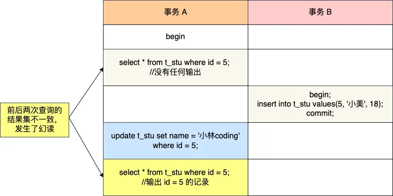

# MySQL事务与锁

## 事务

### 事务特性与隔离级别

#### ACID
* 原子性（Atomicity）：一个事务中的所有操作，要么全部完成，要么全部不完成，不会结束在中间某个环节。（undo log保证）
* 一致性（Consistency）：事务操作前和操作后，数据满足完整性约束，数据库保持一致性状态。（通过A、I、D保证）
* 隔离性（Isolation）：多个事务同时使用相同的数据时，不会相互干扰，每个事务都有一个完整的数据空间，对其他并发事务是隔离的。（MVCC或锁保证）
* 持久性（Durability）：事务处理结束后，对数据的修改就是永久的，即便系统故障也不会丢失。（通过redo log保证）

#### 隔离级别
* 并行事务处理时会发生的现象：脏读、不可重复读、幻读
  * 脏读：事务A读到了事务B未提交的数据。
  * 不可重复读：在一个事务内多次读取同一个数据，如果出现前后两次读到的数据不一样的情况，就意味着发生了不可重复读现象。
  * 幻读：在一个事务内多次查询某个符合查询条件的记录数量，如果出现前后两次查询到的记录数量不一样的情况，就意味着发生了幻读现象。
  
* 四个隔离级别
  * 读未提交（read uncommitted），指一个事务还没提交时，它做的变更就能被其他事务看到；（会出现脏读、不可重复读、幻读）
  * 读提交（read committed），指一个事务提交之后，它做的变更才能被其他事务看到；（会出现不可重复读、幻读）
  * **可重复读**（repeatable read），指一个事务执行过程中看到的数据，一直跟这个事务启动时看到的数据是一致的，MySQL InnoDB 引擎的默认隔离级别；（会出现幻读）
  * 串行化（serializable ）；会对记录加上读写锁，在多个事务对这条记录进行读写操作时，如果发生了读写冲突的时候，后访问的事务必须等前一个事务执行完成，才能继续执行；
  > TIP
  >
  > 对于「读提交」和「可重复读」隔离级别的事务来说，它们是通过 Read View 来实现的，它们的区别在于创建 Read View 的时机不同。**「读提交」隔离级别是在「每个语句执行前」都会重新生成一个 Read View，而「可重复读」隔离级别是「启动事务时」生成一个 Read View**，然后整个事务期间都在用这个 Read View。

* MySQL的可重复读隔离级别对幻读的处理（不能完全避免）
  * 针对**快照读**（普通 select 语句）：通过 MVCC 方式解决了幻读；
  * 针对**当前读**（select ... for update 等语句）：通过 next-key lock（记录锁+间隙锁）方式解决了幻读。
  > TIP
  >
  > 什么情况下还是会出现幻读？
  > case 1:
  > case 2:
  >* T1 时刻：事务 A 先执行「快照读语句」：select * from t_test where id > 100 得到了 3 条记录。
  >* T2 时刻：事务 B 往插入一个 id= 200 的记录并提交；
  >* T3 时刻：事务 A 再执行「当前读语句」 select * from t_test where id > 100 for update 就会得到 4 条记录，此时也发生了幻读现象。
要避免这类特殊场景下发生幻读的现象的话，就是尽量在开启事务之后，马上执行 select ... for update 这类当前读的语句，因为它会对记录加 next-key lock，从而避免其他事务插入一条新记录。
  
### ReadView和MVCC
ReadView结构：

> TIP
>
> 一个事务去访问记录的时候，除了自己的更新记录总是可见之外，还有这几种情况：
> * 如果记录的 trx_id 值小于 Read View 中的 min_trx_id 值，表示这个版本的记录是在创建 Read View 前已经提交的事务生成的，所以该版本的记录对当前事务可见。
> * 如果记录的 trx_id 值大于等于 Read View 中的 max_trx_id 值，表示这个版本的记录是在创建 Read View 后才启动的事务生成的，所以该版本的记录对当前事务不可见。
> * 如果记录的 trx_id 值在 Read View 的 min_trx_id 和 max_trx_id 之间，需要判断 trx_id 是否在 m_ids 列表中：
>   * 如果记录的 trx_id 在 m_ids 列表中，表示生成该版本记录的活跃事务依然活跃着（还没提交事务），所以该版本的记录对当前事务不可见。
>   * 如果记录的 trx_id 不在 m_ids列表中，表示生成该版本记录的活跃事务已经被提交，所以该版本的记录对当前事务可见。

聚簇索引隐藏列：

> roll_ptr指向下一条undo log，下一条undo log也是这样的结构，这样，就构成了一条版本链。

## 锁

### MySQL有哪些锁
* 全局锁
* 表级锁
  * 表锁
  * 元数据锁：MDL 是为了保证当用户对表执行 CRUD 操作时，防止其他线程对这个表结构做了变更。MDL 是在事务提交后才会释放，这意味着事务执行期间，MDL 是一直持有的，这主要是考虑到长事务中对数据表的结构修改会影响其他事务的执行。（读读兼容、读写互斥、写写互斥）
  * 意向锁：对表内某些记录加**行级**读写锁之前会先申请**表级意向锁**。意向锁的目的是为了快速判断表里是否有记录被加锁。
    意向共享锁和意向独占锁是表级锁，不会和行级的共享锁和独占锁发生冲突，而且**意向锁之间也不会发生冲突**，只会和表读锁和表写锁发生冲突。
  * AUTO-INC锁：表里的主键通常都会设置成自增的，这是通过对主键字段声明 AUTO_INCREMENT 属性实现的。AUTO-INC 锁是特殊的表锁机制，锁不是再一个事务提交后才释放，而是再执行完插入语句后就会立即释放。
* 行级锁
  InnoDB 引擎是支持行级锁的，而 MyISAM 引擎并不支持行级锁。
  * Record Lock
  * Gap Lock
  * Nexy-Key Lock：Record Lock + Gap Lock 的组合，锁定一个范围，并且锁定记录本身。
  * 插入意向锁（注意和表级锁中的意向锁进行区分）：它是一种**特殊的间隙锁**，属于行级别锁。两个事务却不能在同一时间内，一个拥有间隙锁，另一个拥有该间隙区间内的插入意向锁。

### MySQL是怎么加锁的
[几个案例](https://xiaolincoding.com/mysql/lock/how_to_lock.html#mysql-%E6%98%AF%E6%80%8E%E4%B9%88%E5%8A%A0%E8%A1%8C%E7%BA%A7%E9%94%81%E7%9A%84)

注意非唯一索引加锁情况。
> select * from user where age >= 22  for update;
> 

> TIP
> 
> MySQL 行级锁的加锁规则：
>  * 唯一索引等值查询：
  当查询的记录是「存在」的，在索引树上定位到这一条记录后，将该记录的索引中的 next-key lock 会退化成「记录锁」。
  当查询的记录是「不存在」的，在索引树找到第一条大于该查询记录的记录后，将该记录的索引中的 next-key lock 会退化成「间隙锁」。
>  * 非唯一索引等值查询：
  当查询的记录「存在」时，由于不是唯一索引，所以肯定存在索引值相同的记录，于是非唯一索引等值查询的过程是一个扫描的过程，直到扫描到第一个不符合条件的二级索引记录就停止扫描，然后在扫描的过程中，对扫描到的二级索引记录加的是 next-key 锁，而对于第一个不符合条件的二级索引记录，该二级索引的 next-key 锁会退化成间隙锁。同时，在符合查询条件的记录的**主键索引上加记录锁**。
  当查询的记录「不存在」时，扫描到第一条不符合条件的二级索引记录，该二级索引的 next-key 锁会退化成间隙锁。因为不存在满足查询条件的记录，所以不会对主键索引加锁。

### MySQL死锁了怎么办

#### 原因

**间隙锁**的意义只在于阻止区间被插入，因此是可以共存的。一个事务获取的间隙锁不会阻止另一个事务获取同一个间隙范围的间隙锁。
这里的共同间隙包括两种场景：
* 其一是两个间隙锁的间隙区间完全一样；
* 其二是一个间隙锁包含的间隙区间是另一个间隙锁包含间隙区间的子集。

但是有一点要注意，**next-key lock 是包含间隙锁+记录锁的**，如果一个事务获取了 X 型的 next-key lock，那么另外一个事务在获取相同范围的 X 型的 next-key lock 时，是会被阻塞的，即记录锁要考虑 X 型与 S 型关系。

[死锁案例](https://xiaolincoding.com/mysql/lock/deadlock.html#%E4%B8%BA%E4%BB%80%E4%B9%88%E4%BC%9A%E4%BA%A7%E7%94%9F%E6%AD%BB%E9%94%81)

插入意向锁与间隙锁是冲突的，所以当其它事务持有该间隙的间隙锁时，需要等待**其它事务**释放间隙锁之后，才能获取到插入意向锁。间隙锁与间隙锁之间是兼容的。
> 插入意向锁只在**并发插入**时会用到。

#### 死锁避免
死锁的四个必要条件：**互斥、占有且等待、不可强占用、循环等待**。只要系统发生死锁，这些条件必然成立，但是只要破坏任意一个条件就死锁就不会成立。
因此可以：
* 设置事务超时时间
* 开启主动死锁检测