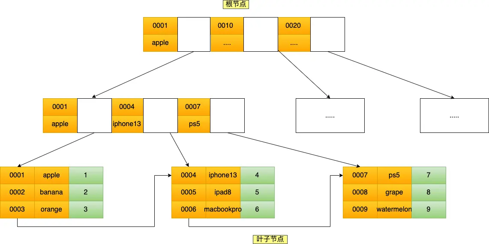

# MySQL索引

## 概念
**几种数据结构对比**：[平衡二叉树、B树、B+树、B*树介绍](https://zhuanlan.zhihu.com/p/27700617) 与 [演示链接](https://www.cs.usfca.edu/~galles/visualization/Algorithms.html)

**回表**：查询二级索引时将会得到主键值，根据主键值查询主键索引才能得到整行数据，这个过程叫做回表，即需要查询这两个B+树才能得到数据本身。

**覆盖查找**：如SQL语句`select id from product where product_no = '0002';`，在二级索引中即可得到主键值，因此直接返回主键ID即可而无需查询主键索引，这个过程叫覆盖查找。

**索引下推**：MySQL 5.6 引入的索引下推优化，可以在联合索引遍历过程中，对联合索引中包含的字段先做判断，直接过滤掉不满足条件的记录，减少回表次数，该优化过程在引擎层进行。

**联合索引**：联合索引树形结构如下（该图建立了`<id,name>`的二级联合索引，叶子结点为双向链表）：

并不是查询过程使用了联合索引查询，就代表联合索引中的所有字段都用到了联合索引进行索引查询，比如字段需要**范围查找**时，则该范围查找字段后的字段无法使用联合索引，因为在这个范围中，后面的字段是无序的。
> **TIP**
> 
> 但是`select * from t_table where a >= 1 and b = 2;`这个语句查询过程中，虽然在符合`a >= 1`条件的二级索引记录的范围里，`b`字段的值是无序的，但是对于符合`a = 1`的二级索引记录的范围里，`b`字段的值是有序的。
> 于是，在确定需要扫描的二级索引的范围时，当二级索引记录的`a`字段值为1时，可以通过`b = 2`条件减少需要扫描的二级索引记录范围（`b`字段可以利用联合索引进行索引查询的意思）。
> 也就是说，从符合`a = 1 and b = 2`条件的第一条记录开始扫描，而不需要从第一个`a`字段值为1的记录开始扫描。

## MySQL的B+树

### 为什么选择B+树？
* B+Tree 是一种多叉树，**叶子节点才存放数据，非叶子节点只存放索引**，而且每个节点里的数据是按主键顺序存放的，索引叶子结点结构为一条双向链表。
* 数据库的索引和数据都是存储在硬盘的。**B+Tree 只在叶子节点存储数据，而 B 树 的非叶子节点也要存储数据，所以 B+Tree 的单个节点的数据量更小，在相同的磁盘 I/O 次数下，就能查询更多的节点**。另外，B+Tree 叶子节点采用的是**双向链表**连接，适合 MySQL 中常见的基于范围的顺序查找，而 B 树无法做到这一点。
* 在实际应用中，B+树的度大于100，保证千万量级数据下B+树的高度为3-4，减少磁盘I/O次数。
* Hash在等值查询时非常高效，但是Hash表不适合做范围查询。

### MySQL B+树数据页

数据页中的记录按照主键顺序组成单向链表，数据页中有一个页目录，起到记录的索引作用：

通过槽查找记录时，可以使用二分法快速定位要查询的记录在哪个槽（哪个记录分组），定位到槽后，再遍历槽内的所有记录，找到对应的记录。

## 索引失效与索引优化

### 索引失效
* 联合索引失效：如<a href="#union_idx">前文</a>所示，使用联合索引时，存在**最左匹配**原则，即若不设定`id`的查询条件直接根据`name`的条件查询，则该联合索引失效。值得注意的是，由于**优化器**对SQL语句的优化措施，打乱`where`中的顺序不影响查询方案的确定。
* **左或者左右模糊匹配**：`like %xx` 或者 `like %xx%`。
* 对索引列做了**计算**、函数、类型转换操作。
* 在 WHERE 子句中，如果在 `OR` 前的条件列是索引列，而在 `OR` 后的条件列不是索引列，那么索引会失效。
> **TIP**
> 
> 索引效率排行（低到高）：
> * All（全表扫描）；
> * index（全索引扫描）；
> * range（索引范围扫描）；
> * ref（非唯一索引扫描）；
> * eq_ref（唯一索引扫描）；
> * const（结果只有一条的主键或唯一索引扫描）。

### 索引优化
* 前缀优化：使用某个字段中字符串的前几个字符建立索引，既减小索引字段大小，又有效提高索引的查询速度。
* 覆盖索引优化：当不需要查询出所有字段时，可以建立一个联合索引，即「商品ID、名称、价格」作为一个联合索引。使用覆盖索引的好处就是，不需要查询出包含整行记录的所有信息，也就减少了大量的 I/O 操作。
* 主键自增：主键自增时新增记录是追加操作，能避免**页分裂**的情况。页分裂会造成大量的存储碎片，导致查询效率不高。
* NOT NULL：索引列存在 NULL 就会导致优化器在做索引选择的时候更加复杂，更加难以优化。NULL 值是一个没意义的值，但是它会占用物理空间，所以会带来的存储空间的问题。
* 避免索引失效

## 什么时候用索引
使用索引的场景：字段唯一性、经常where、group by、order by

不需要使用索引的场景：字段存在大量重复数据（比如性别）、经常更新的字段

## 拓展
* MyISAM 和 InnoDB 中 B+ 树的差异：
  > MyISAM 引擎中，B+Tree 叶节点的 data 域存放的是数据记录的地址。在索引检索的时候，首先按照 B+Tree 搜索算法搜索索引，如果指定的 Key 存在，则取出其 data 域的值，然后以 data 域的值为地址读取相应的数据记录。这被称为“**非聚簇索引**”。
  > InnoDB 引擎中，其数据文件本身就是索引文件。相比 MyISAM，索引文件和数据文件是分离的，其表数据文件本身就是按 B+Tree 组织的一个索引结构，树的叶节点 data 域保存了完整的数据记录。这个索引的 key 是数据表的主键，因此 InnoDB 表数据文件本身就是主索引。这被称为“**聚簇索引**（或聚集索引）”，而其余的索引都作为辅助索引，辅助索引的 data 域存储相应记录主键的值而不是地址，这也是和 MyISAM 不同的地方。在根据主索引搜索时，直接找到 key 所在的节点即可取出数据；在根据辅助索引查找时，则需要先取出主键的值，再走一遍主索引。 因此，在设计表的时候，不建议使用过长的字段作为主键，也不建议使用非单调的字段作为主键，这样会造成主索引频繁分裂。

* MySQL 在遇到字符串和数字比较的时候，会自动把字符串转为数字，然后再进行比较。
  
* 脑筋急转弯：使用左模糊匹配（like "%xx"）并不一定会走全表扫描，关键还是看数据表中的字段。如果数据库表中的字段只有主键+二级索引，那么即使使用了左模糊匹配，也不会走全表扫描（type=all），而是走全扫描二级索引树(type=index)。

* count性能对比：
  `count()`是一个聚合函数，函数的参数不仅可以是字段名，也可以是其他任意表达式，该函数作用是**统计符合查询条件的记录**中，函数指定的参数**不为 NULL**的记录有多少个。
  > count(*)=count(1)>count(主键字段)>count(字段)

  MySQL 会对 count(*) 和 count(1) 有个优化，如果有多个二级索引的时候，优化器会使用`key_len`最小的二级索引进行扫描。

* 大表count()操作时费时间：
  * 使用近似值（如explain命令）
  * 新建额外表保存计数信息