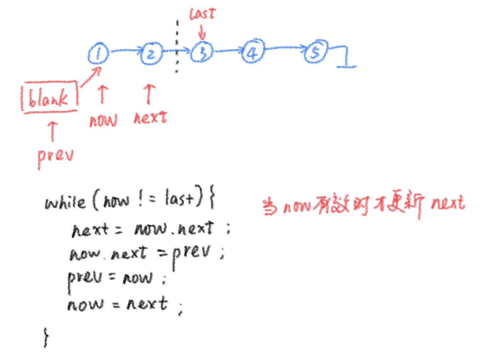
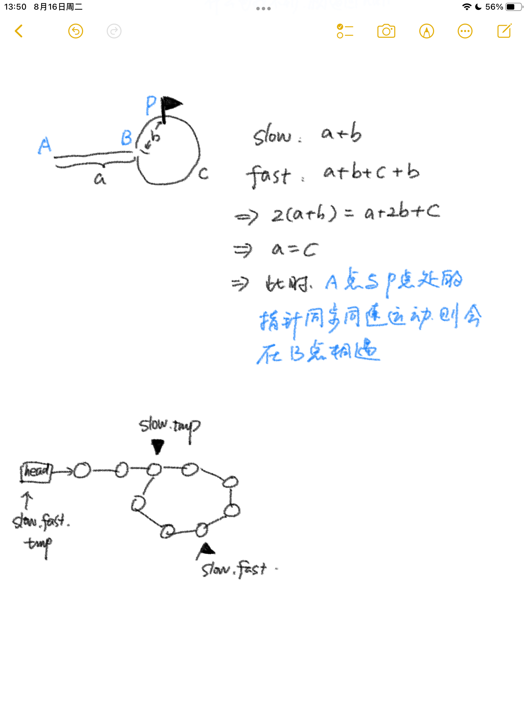

# 链表

## 翻转链表

### [ K 个一组翻转链表](https://leetcode.cn/problems/reverse-nodes-in-k-group/)



```java
public ListNode reverseKGroup(ListNode head, int k) {
  if (k == 1 || head == null)
    return head;
  ListNode blank = new ListNode();
  blank.next = head;
  int count = k;
  ListNode last = head;
  while (count > 0) {
    last = last.next;
    --count;
    if (last == null && count > 0)
      return head;
  }
  ListNode prev = blank;
  ListNode now = head;
  ListNode next = now;
  while(now!=last){
    next = now.next;
    now.next = prev;
    prev = now;
    now = next;
  }
  head.next = reverseKGroup(now, k);
  return prev;
}
```

### [重排链表](https://leetcode.cn/problems/reorder-list/)

```java
//使用Deque更方便，为追求极致的空间复杂度可以先找中点，再反转，再拼接
class Solution {
  public void reorderList(ListNode head) {
    Deque<ListNode> deque = new LinkedList<>();
    ListNode tmp = head.next;
    while (tmp != null) {
      deque.addLast(tmp);
      tmp = tmp.next;
    }
    boolean flag = true;
    tmp = head;
    while (!deque.isEmpty()) {
      tmp.next = (flag ? deque.pollLast() : deque.pollFirst());
      tmp = tmp.next;
      flag = !flag;
    }
    tmp.next=null;
  }
}
```

### [排序链表](https://leetcode.cn/problems/sort-list/)

```java
//可以对链表一分为二进行归并排序，在操作的过程中可以断开两个链表的链接，这样处理更加方便

//也可以参考快速排序，用两个空节点收录比pivot大的节点串和比pivot小的节点串，再对这两个串处理，处理之后按照“小->pivot->大”这样的顺序组装返回
```


## 环形链表找环的入口

### [环形链表 II](https://leetcode.cn/problems/linked-list-cycle-ii/)

```java
public class Solution {
  public ListNode detectCycle(ListNode head) {
    if(head == null) return null; 
    ListNode slow = head;
    ListNode fast = head.next;
    ListNode empty = new ListNode();
    empty.next = head;
    while (slow != fast && fast != null) {
      slow = slow.next;
      fast = fast.next;
      if (fast == null)
        break;
      fast = fast.next;
    }
    if (fast == null)
      return null;
    ListNode tmp = empty;
    while (tmp != fast) {
      tmp = tmp.next;
      fast = fast.next;
    }
    return tmp;
  }
}
```


