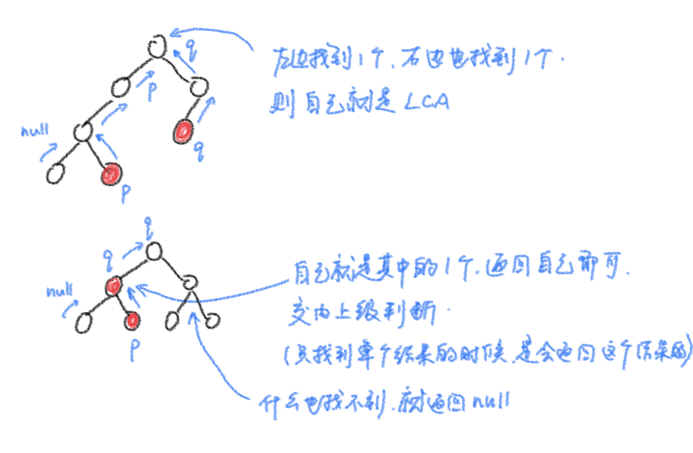

# 树

## [序列化与反序列化](https://leetcode.cn/problems/h54YBf/)

```java
  class TreeNode {
    int val;
    TreeNode left;
    TreeNode right;

    TreeNode(int x) {
      val = x;
    }
  }

  class Codec {
    // Encodes a tree to a single string.
    public String serialize(TreeNode root) {
      Queue<TreeNode> queue = new LinkedList<>();
      StringBuilder sb = new StringBuilder();
      queue.add(root);
      while (!queue.isEmpty()) {
        TreeNode tn = queue.remove();
        if (tn == null) {
          sb.append("*,");
        } else {
          sb.append(tn.val + ",");
          queue.add(tn.left);
          queue.add(tn.right);
        }
      }
      System.out.println(sb.toString());
      return sb.toString();
    }

    // Decodes your encoded data to tree.
    public TreeNode deserialize(String data) {
      if (data.length() == 0)
        return null;
      String[] strs = data.split(",");
      int n = strs.length;
      if (strs[0].equals("*"))
        return null;
      TreeNode head = new TreeNode(Integer.valueOf(strs[0]));
      Queue<TreeNode> queue = new LinkedList<>();
      queue.add(head);
      int index = 1;
      while (!queue.isEmpty() && index < n) {
        TreeNode tn = queue.remove();
        TreeNode left = (strs[index].equals("*") ? null : new TreeNode(Integer.valueOf(strs[index])));
        index++;
        TreeNode right = (strs[index].equals("*") ? null : new TreeNode(Integer.valueOf(strs[index])));
        index++;
        tn.left = left;
        tn.right = right;
        if (left != null)
          queue.add(left);
        if (right != null)
          queue.add(right);
      }
      return head;
    }
  }

```

## 树的搜索

### LCA：[二叉树的最近公共祖先](https://leetcode.cn/problems/lowest-common-ancestor-of-a-binary-tree/)

```java
class Solution {
  public TreeNode lowestCommonAncestor(TreeNode root, TreeNode p, TreeNode q) {
    if (root == null)
      return root;
    if (root == p || root == q)
      return root;
    TreeNode left = lowestCommonAncestor(root.left, p, q);
    TreeNode right = lowestCommonAncestor(root.right, p, q);
    if (left != null && right != null)
      return root;
    if (left != null)
      return left;
    if (right != null)
      return right;
    return null;
  }
}
```



### [二叉树中的最大路径和](https://leetcode.cn/problems/binary-tree-maximum-path-sum/)

```java
final int minimum = -1000;
int res = minimum;

public int search(TreeNode root) {
  if (root == null)
    return minimum;
  int left = search(root.left);
  int right = search(root.right);
  int maximumCombine = Math.max(0, Math.max(left, right)) + root.val;
  res = Math.max(res, Math.max(maximumCombine, left + right + root.val));
  return maximumCombine;
}

public int maxPathSum(TreeNode root) {
  search(root);
  return res;
}
```

更新res的时候有多种情况。返回上层时要确保root在计算结果中，以便上层能够连接子树结果。
